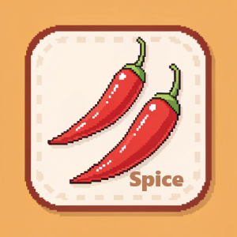

<h1 align="center">Spice - A Wallpaper Manager for Windows & macOS</h1>

Spice transforms your desktop with stunning, fresh wallpapers from wallhaven.cc. Download the latest version for your OS here: [**Latest Release**](https://github.com/dixieflatline76/Spice/releases/latest)

Spice is a desktop background manager for Windows and macOS, inspired by the legendary Linux wallpaper manager, [Variety](https://github.com/varietywalls/variety). Built entirely in Go and using Fyne for its minimalist UI, Spice aims to provide a seamless and customizable wallpaper experience.

    
  

**Important Note:** Spice works its magic in the background. You'll interact with it through its icon in the **Windows system tray** or the **macOS menu bar**.

## ✨ Features

* **Cross-Platform:** Native support for both Windows (amd64) and macOS (Apple Silicon).
* **Wallhaven.cc Support:** Fetch wallpapers from [wallhaven.cc](https://wallhaven.cc/), with support for API keys to access user collections (favorites) and NSFW content.
* **Multiple Image Queries:** Define multiple queries to diversify your wallpaper collection (e.g., one for landscapes, another for abstract art).
* **Menu Bar / System Tray Controls:** Easily navigate through your wallpaper cache with next, previous, and random image options.
* **Smart Fit:** Enjoy perfectly framed wallpapers every time. Smart Fit intelligently crops and pans images to best fit your desktop, ensuring they look fantastic on any screen.
* **Fully Configurable:** No digging through config files! Configure everything through a user-friendly preference panel.
* **Image Caching & Blocklist:** Spice caches images to save bandwidth and lets you delete and block any wallpaper you don't like.
* **App Notifications:** Get notified of key events, like when new images are downloaded.

## ✅ Platform Support

Spice is currently available for:
* **Windows 10 & 11** (64-bit, amd64)
* **macOS** (Apple Silicon: M1, M2, M3, etc.)

## 📦 Download & Installation

Head to the [**Releases Page**](https://github.com/dixieflatline76/Spice/releases/latest) to download the correct version for your operating system. For security, we recommend verifying the download using the provided `.sha256` checksum file.

---
### For Windows

1.  **Download** `Spice-Setup-x.x.x-amd64.exe` and the corresponding `.sha256` file.
2.  **(Optional) Verify the download:**
    * Open PowerShell and run the command: `certutil -hashfile C:\path\to\Spice-Setup-x.x.x-amd64.exe SHA256`
    * Compare the output hash with the contents of the `.sha256` file. They should match.
3.  **Install:** Double-click the `.exe` file and follow the installer prompts.

---
### For macOS (Apple Silicon)

1.  **Download** `Spice-vx.x.x-arm64.dmg` and the corresponding `.sha256` file.
2.  **(Optional) Verify the download:**
    * Open Terminal and run the command: `shasum -a 256 /path/to/Spice-vx.x.x-arm64.dmg`
    * Compare the output hash with the contents of the `.sha256` file. They should match.
3.  **Install:**
    * Open the `.dmg` file.
    * Drag the **Spice** icon into your **Applications** folder.
    * The first time you open Spice, you may need to confirm you want to run an application downloaded from the internet.

## 🚀 Usage

### Configuration
Access the Preferences panel by clicking the Spice icon in the Windows system tray or macOS menu bar and selecting "Preferences".

### Wallhaven.cc API Key
An API Key is **required** to use features like NSFW filters and personal collections (Favorites). You can generate a free API key from your [wallhaven.cc account settings](https://wallhaven.cc/settings/account).

### Keeping the Icon Visible

**On Windows:**
Windows often hides new tray icons. Click the `^` arrow in your system tray and drag the Spice icon into the visible taskbar area to pin it.

**On macOS:**
The Spice icon will appear in the menu bar at the top-right of your screen. If you use a menu bar organizer tool, ensure Spice is set to be visible.

## ⚠️ Known Issues

* **Single Display Only:** Spice currently only sets the wallpaper on your primary display. Full multi-monitor support is a planned feature for a future release.
* **Windows Background Style:** The wallpaper fit options (Fill, Stretch, etc.) are temporarily controlled by Windows itself. To change this, go to `Settings > Personalization > Background > Choose a fit`. This setting does not affect macOS.
* **Blocklist Editing:** Currently, you can only reset the entire blocklist via the preference panel. The ability to remove individual images from the blocklist will be added in a future release.

##  futuristic Future Plans

Spice is under active development! Here's what's on the roadmap:
* **Linux & Intel Mac Support:** Extend Spice to run on Linux and Intel-based Macs.
* **Expanded Wallpaper Sources:** Add support for more services like Unsplash.
* **LLM Integration:** Explore integrating a Large Language Model for daily quotes or jokes.

## 🤝 Contributing

Contributions are welcome! Feel free to report bugs, suggest features, or submit pull requests. Please check the [Issues page](https://github.com/dixieflatline76/Spice/issues) to get started.

## 📜 License

MIT License - Copyright (c) 2025 Karl Kwong
