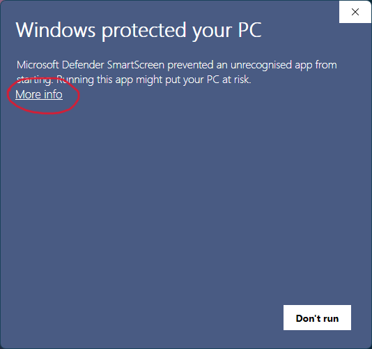
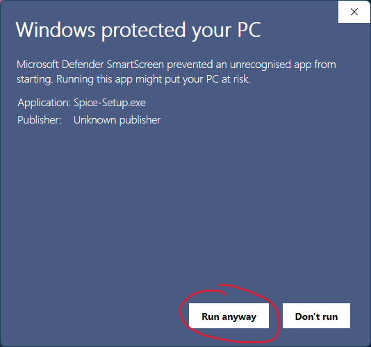

<p align="center"></p>

<h1 align="center">Spice - A Windows Wallpaper Background Manager</h1>

Spice transforms your desktop with stunning wallpapers. Download the latest version here: [latest release](https://github.com/dixieflatline76/Spice/releases/latest)

Spice is a work-in-progress desktop background manager for Windows, inspired by the legendary Linux wallpaper manager, [Variety](https://github.com/varietywalls/variety). Built entirely in Go and using Fyne for its minimalist UI (system tray icon and menu), Spice aims to provide a seamless and customizable wallpaper experience.

<p align="center">    
</p>

**Important Notes:**


* **Spice runs in the background:** The primary way to interact with Spice is through its icon in the system tray (notification area).
* **License Agreement:** When running Spice for the first time, you will be presented with the license agreement. You must accept this agreement to continue using Spice.
* **Wallhaven.cc Account and API Key:** While a wallhaven API Key is not required to use Spice, an API Key is needed if you are interested in using NSFW images. In the future, we plan on adding wallhaven collection (favorites) support which will also require the API Key. You can generate an API key from [wallhaven.cc](https://wallhaven.cc/) (logged in) by visiting [https://wallhaven.cc/settings/account](https://wallhaven.cc/settings/account). **Please note that wallhaven may change their API policy in the future, and an API key may become required for all features.**

## Features

* **Wallhaven.cc support:** Fetch wallpapers from [wallhaven.cc](https://wallhaven.cc/), with support for API keys. Find exactly what you're looking for!
* **Multiple image queries:** Define multiple queries to diversify your wallpaper collection (e.g., one for landscapes, another for abstract art). Never run out of fresh options!
* **System tray controls:** Easily navigate through your wallpaper cache with next, previous, and random image options. Quickly change your wallpaper with a single click.
* **Daily image cache refresh:** Keep your wallpapers fresh with automatic cache updates every midnight. Set it and forget it!
* **Fully configurable via Preference Panel:** No digging through config files! Spice is now entirely configured through a user-friendly preference panel.
* **Smart Fit:** Enjoy perfectly framed wallpapers every time. Smart Fit intelligently crops and pans images to best fit your desktop resolution, ensuring they look fantastic on any screen. Say goodbye to awkwardly stretched or cropped images! This feature is powered by the excellent work of [muesli/smartcrop](https://github.com/muesli/smartcrop) and [jwagner/smartcrop.js](https://github.com/jwagner/smartcrop.js).
* **Shuffle:** Toggle Shuffle Wallpapers directly from the tray menu to add even more variety to your desktop.
* **App Notifications:** Spice will inform you of key events like downloading of new images or changing of key configurations via system notifications.
* **Image cache** Spice now caches downloaded images and will only download new images it cannot find in the cache. In the future we will let you take control of how many images Spice will keep. In this release it is set to 200. This means Spice will hold up to 200 of the most recent images for future use.

## Known Issues

* **Background Render Style:** Options to control how the wallpaper is displayed (Fill, Stretch, Span, etc.) have been temporarily removed due to a known issue. You can still adjust this setting manually through Windows: `Settings > Personalization > Background > Choose a fit for your desktop image`. With Smart Fit enabled, you can now confidently select any of the Windows fit options, knowing the downloaded image will seamlessly match your desktop resolution. We are working to restore these options in a future update.

## Download and Verify

1. **Download** the latest release of Spice from the [releases page](https://github.com/dixieflatline76/Spice/releases/latest). Make sure to download both the `Spice-Setup.exe` executable and the corresponding `.sha256` checksum file (e.g., `Spice-Setup.exe.sha256`).

2. **Verify** the integrity of the downloaded `Spice-Setup.exe` file using the following steps:

    * **Calculate** the SHA256 checksum of the downloaded `Spice-Setup.exe` file using a tool like `certutil` (Windows) or `shasum` (Linux/macOS).
        * On Windows, open PowerShell and run: `certutil -hashfile Spice-Setup.exe SHA256`
        * (Future) On Linux/macOS, run: `shasum -a 256 Spice`
    * **Compare** the calculated checksum with the value in the `Spice-Setup.exe.sha256` file. If they match, the download is intact.

**Example:**

If the `Spice-Setup.exe.sha256` file contains:

```
SHA256 hash of file Spice-Setup.exe:
6E643A3370D4114654A9B041C8619191979768F2A0133B514C0F9A16366191D9
```

Then the output of the checksum calculation command should also be:

```
6E643A3370D4114654A9B041C8619191979768F2A0133B514C0F9A16366191D9
```

If the checksums don't match, **do not run the executable**. Redownload the files and try again.

## Future Plans

Spice is under active development! Here's what's on the roadmap:

* **Mac and Linux:** Extend Spice support to include Mac OS and Linux machines.
* **Expanded wallpaper sources:** Support for more wallpaper services beyond wallhaven.cc (e.g., Unsplash, Pexels).
* **LLM Integration:** Explore integrating an LLM (Large Language Model) to provide daily quotes, jokes, and even chat support within Spice.

## Current Status

Spice is currently available for 64bit Windows PCs (amd64) and primarily tested on Windows 11. 

**Known Issues:**

* **Background Render Style:** Options to control how the wallpaper is displayed (Fill, Stretch, Span, etc.) have been temporarily removed due to a known issue. You can still adjust this setting manually through Windows: `Settings > Personalization > Background > Choose a fit for your desktop image`. With Smart Fit enabled, you can now confidently select any of the Windows fit options, knowing the downloaded image will seamlessly match your desktop resolution.  We are working to restore these options in a future update.

## Installation

Download the latest release of `Spice-Setup.exe` from here: [release page](https://github.com/dixieflatline76/Spice/releases) Once downloaded, just double-clicking `Spice-Setup.exe` either directly from your browser download section or in File Explorer. During the installation, you can choose to have the installer setup Spice to run everytime Windows startup. During the very last step, you can choose to launch Spice after the install is finished.

**Important Note:** When running Spice-Setup.exe on Windows, you will likely encounter a Windows protection dialog stating you are running an unrecognized app. This is because Spice-Setup is not signed with a digital certificate that costs upwards of 500 euros per year. We provided an alternative authenticity and security verification method via the SHA256 signature mentioned in the previous section. Along with the open source nature of Spice, you can safely proceed with installation as shown:

<p align="center"> </p>

## Manual Installation

If you opted not to use `Spice-Setup.exe` instead choosing to download `Spice.exe`, it is possible to manually add Spice to Windows startup using the Startup Folder:

1.  Press `Windows Key + R` to open the Run dialog.
2.  Type `shell:startup` and press Enter. This will open the Startup folder.
3.  Create a shortcut to the Spice executable and place it in the Startup folder. (Right-click the Spice executable, select "Create shortcut," and then drag the shortcut into the Startup folder.)

## Configuration

Spice is now entirely configured through the preference panel. You can access it by *left*-clicking the Spice icon in the system tray to open the Spice menu, and then selecting "Preferences".

## Image Page (Attribution and NSFW Content)

When selecting "Image Page" from the tray menu, Spice attempts to open the image's source page on [wallhaven.cc](https://wallhaven.cc/). This provides attribution to the image service. **Important:** If the image contains NSFW content, you *must* be signed in to your wallhaven.cc account in your web browser for the page to open correctly.

## Keeping Spice's Tray Icon Visible

Windows often hides newly added system tray icons. To ensure Spice's icon is always visible and accessible:

1. Click the up arrow (or similar) in the system tray to expand the hidden icons area.
2. Click "Customize..."
3. In the Settings window that opens, find "Spice" in the list of icons.
4. From the dropdown menu next to "Spice," select "Show icon and notifications."

This will keep the Spice icon permanently visible in your system tray, allowing you to easily control the application.

## Contributing

Contributions are welcome! Here's how you can get involved:

* **Report bugs:** Open an issue to report any problems you encounter.
* **Suggest features:** Open an issue to propose new features or improvements.
* **Contribute code:** Submit pull requests to contribute code changes.

## License

MIT License

Copyright (c) 2025 Karl Kwong

Permission is hereby granted, free of charge, to any person obtaining a copy
of this software and associated documentation files (the "Software"), to deal
in the Software without restriction, including without limitation the rights
to use, copy, modify, merge, publish, distribute, sublicense, and/or sell
copies of the Software, and to permit persons to whom the Software is
furnished to do so, subject to the following conditions:

The above copyright notice and this permission notice shall be included in all
copies or substantial portions of the Software.

THE SOFTWARE IS PROVIDED "AS IS", WITHOUT WARRANTY OF ANY KIND, EXPRESS OR
IMPLIED, INCLUDING BUT NOT LIMITED TO THE WARRANTIES OF MERCHANTABILITY,
FITNESS FOR A PARTICULAR PURPOSE AND NONINFRINGEMENT. IN NO EVENT SHALL THE
AUTHORS OR COPYRIGHT HOLDERS BE LIABLE FOR ANY CLAIM, DAMAGES OR OTHER
LIABILITY, WHETHER IN AN ACTION OF CONTRACT, TORT OR OTHERWISE, ARISING FROM,
OUT OF OR IN CONNECTION WITH THE SOFTWARE OR THE USE OR OTHER DEALINGS IN THE
SOFTWARE.
