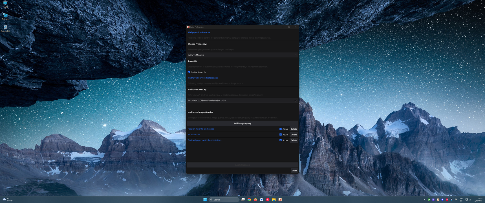
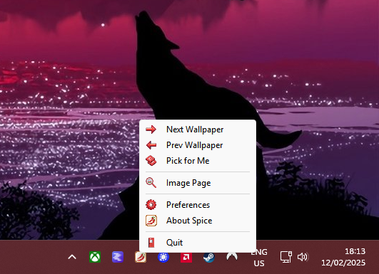

# Spice - A Windows Desktop Background Manager 
Spice transforms your desktop with stunning wallpapers. Download the latest version here: [latest release](https://github.com/dixieflatline76/Spice/releases/latest)

Spice is a work-in-progress desktop background manager for Windows, inspired by the legendary Linux wallpaper manager, [Variety](https://github.com/varietywalls/variety). Built entirely in Go and using Fyne for its minimalist UI (system tray icon and menu), Spice aims to provide a seamless and customizable wallpaper experience.

    

**Important Notes:**

* Spice runs in the background. The primary way to interact with Spice is through its icon in the system tray (notification area).
* **License Agreement:** When running Spice for the first time, you will be presented with the license agreement. You must accept this agreement to continue using Spice.
* **Wallhaven.cc Account and API Key:** To use Spice with wallhaven.cc, you need a valid wallhaven.cc account. You also need to generate an API key.  Go to [https://wallhaven.cc/settings/account](https://wallhaven.cc/settings/account) to generate an API key for Spice to function properly.

## Current Features

* **wallhaven.cc support:** Fetch wallpapers from wallhaven.cc, with support for API keys. Find exactly what you're looking for!
* **Multiple image queries:** Define multiple queries to diversify your wallpaper collection (e.g., one for landscapes, another for abstract art). Never run out of fresh options!
* **System tray controls:** Easily navigate through your wallpaper cache with next, previous, and random image options. Quickly change your wallpaper with a single click.
* **Daily image cache refresh:** Keep your wallpapers fresh with automatic cache updates every midnight. Set it and forget it!
* **On-demand image download:** Spice downloads the next batch of images only when needed, optimizing performance.
* **Fully Configurable via Preference Panel:** No more digging through config files! Spice is now entirely configured through a user-friendly preference panel. (New in v0.2.1)
* **Smart Fit:** Enjoy perfectly framed wallpapers every time. Smart Fit intelligently crops and pans images to best fit your desktop resolution, ensuring they look fantastic on any screen. Say goodbye to awkwardly stretched or cropped images! (New in v0.2.1)  This feature is powered by the excellent work of [muesli/smartcrop](https://github.com/muesli/smartcrop) and [jwagner/smartcrop.js](https://github.com/jwagner/smartcrop.js).

## Future Plans

Spice is under active development! Here's what's on the roadmap:

1. **Expanded wallpaper sources:** Support for more wallpaper services beyond wallhaven.cc (e.g., Unsplash, Pexels).
2. **LLM Integration:** Explore integrating an LLM (Large Language Model) to provide daily quotes, jokes, and even chat support within Spice.
3. **Windows Installer:** A proper Windows installer is planned for future releases to simplify the installation process.

## Current Status

Spice is currently in its early stages and primarily tested on Windows 11.

**Known Issues:**

* Occasional delays in wallpaper updates. We are working to improve update speeds.
* Limited customization options beyond the new preference panel. More customization options are planned for future releases.

**Installation:**

1. Download the Spice executable from [latest release](https://github.com/dixieflatline76/Spice/releases/latest).
2. Run executable and enjoy.

**Adding Spice to Windows Startup (Manually):**

While a dedicated installer is planned, you can manually add Spice to Windows startup using the Startup Folder:

1. Press `Windows Key + R` to open the Run dialog.
2. Type `shell:startup` and press Enter.  This will open the Startup folder.
3. Create a shortcut to the Spice executable and place it in the Startup folder.  (Right-click the Spice executable, select "Create shortcut," and then drag the shortcut into the Startup folder.)

**Configuration:**

Spice is now entirely configured through the preference panel. You can access it by *left*-clicking the Spice icon in the system tray to open the Spice menu, and then selecting "Preferences".

**Image Page (Attribution and NSFW Content):**

When selecting "Image Page" from the tray menu, Spice attempts to open the image's source page on wallhaven.cc. This provides attribution to the image service.  **Important:** If the image contains NSFW content, you *must* be signed in to your wallhaven.cc account in your web browser for the page to open correctly.

## Keeping Spice's Tray Icon Visible:

Windows often hides newly added system tray icons. To ensure Spice's icon is always visible and accessible:

1. Click the up arrow (or similar) in the system tray to expand the hidden icons area.
2. Click "Customize..."
3. In the Settings window that opens, find "Spice" in the list of icons.
4. From the dropdown menu next to "Spice," select "Show icon and notifications."

This will keep the Spice icon permanently visible in your system tray, allowing you to easily control the application.

## Contributing

Contributions are welcome! Here's how you can get involved:

* **Report bugs:** Open an issue to report any problems you encounter.
* **Suggest features:** Open an issue to propose new features or improvements.
* **Contribute code:** Submit pull requests to contribute code changes.

## License

MIT License

Copyright (c) 2025 Karl Kwong

Permission is hereby granted, free of charge, to any person obtaining a copy
of this software and associated documentation files (the "Software"), to deal
in the Software without restriction, including without limitation the rights
to use, copy, modify, merge, publish, distribute, sublicense, and/or sell
copies of the Software, and to permit persons to whom the Software is
furnished to do so, subject to the following conditions:

The above copyright notice and this permission notice shall be included in all
copies or substantial portions of the Software.

THE SOFTWARE IS PROVIDED "AS IS", WITHOUT WARRANTY OF ANY KIND, EXPRESS OR
IMPLIED, INCLUDING BUT NOT LIMITED TO THE WARRANTIES OF MERCHANTABILITY,
FITNESS FOR A PARTICULAR PURPOSE AND NONINFRINGEMENT. IN NO EVENT SHALL THE
AUTHORS OR COPYRIGHT HOLDERS BE LIABLE FOR ANY CLAIM, DAMAGES OR OTHER
LIABILITY, WHETHER IN AN ACTION OF CONTRACT, TORT OR OTHERWISE, ARISING FROM,
OUT OF OR IN CONNECTION WITH THE SOFTWARE OR THE USE OR OTHER DEALINGS IN THE
SOFTWARE.
