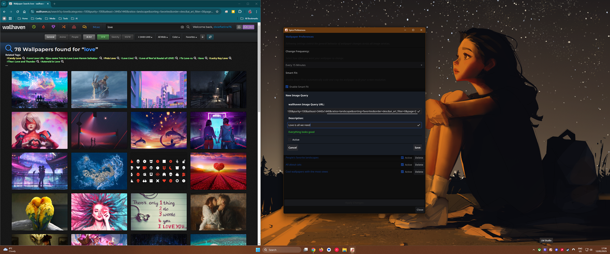

<!-- markdownlint-disable MD033 MD041 -->

<h1 align="center">Spice - Spice Up Your Desktop 🌶️</h1>

  
  
  
  

Spice is a minimalist wallpaper manager that brings a continuous stream of delight to your screen while not getting in your way. It automatically downloads high-quality wallpapers from your favorite image services like Wallhaven and Unsplash, keeping your desktop fresh and fun.

**Note:** Spice runs quietly in your **Windows system tray** or **macOS menu bar**, doing its magic in the background while giving you full control when you need it.

  

## ✨ Key Features

* **🔗 Browser Companion:** Use our [**Chrome Extension**](https://chromewebstore.google.com/detail/ekodikedjmhnganfcfleabcfohdjkoeb) to instantly add wallpapers from the web to your desktop with a single click. Supports Chrome and Safari with LiveSync technology (Firefox coming soon).

* **� Automated Inspiration:** Spice handles the heavy lifting—fetching, caching, and cycling wallpapers based on your preferences so you always have something new to look at.

* **� Wallhaven Integration:** Our original and primary source! Access the vast library of **Wallhaven.cc** with full support for API keys, NSFW filters, and your private collections (Favorites).

* **📸 Native Unsplash & Pexels Integration:** Securely log in to **Unsplash** or browse **Pexels** to access millions of professional, high-quality photos.

* **🏛️ Wikimedia Commons:** Access the wealth of human history and nature with support for **Featured Pictures** and Category composition on Wikimedia Commons.

* **📏 Smart Fit with Face Detection:** Never worry about bad crops again. **Smart Fit Mode** lets you choose between **Standard (Strict)** aspect ratio matching or **Relaxed (Aggressive)** usage of high-res images. Plus, our advanced **Face Boost** technology ensures people are perfectly framed—no more chopped-off heads!

* **⚡ Ultra-Responsive:** Built with advanced concurrency patterns and "Debounced Persistence" to ensure the UI stays buttery smooth, even when managing large collections or downloading in the background.

* **⏯️ Pause & Resume:** Found a wallpaper you absolutely love? Simply **Pause** the rotation to keep it for as long as you want, then **Resume** when you're ready for something new.

* **⌨️ Global Hotkeys:** Control Spice instantly from anywhere:
  * **Next:** `Ctrl + Alt + Right Arrow`
  * **Previous:** `Ctrl + Alt + Left Arrow`
  * **Pause/Resume:** `Ctrl + Alt + Up Arrow`
  * **Trash/Block:** `Ctrl + Alt + Down Arrow`

* **🏷️ Enhanced Attribution:** Know the artist! Spice displays the real uploader or photographer name directly in the tray menu, updating *instantly* with every wallpaper change.

* **⛔ Blocklist:** Don't like a wallpaper? Trash it with a hotkey or click, and Spice will block it forever.

## Developers

* **Architecture:** Curious how Spice works under the hood? Read our [**Architecture Documentation**](docs/architecture.md) for a deep dive into our Single-Writer concurrency model.
* **New Providers:** Want to add your own wallpaper source? Check out our [**Provider Creation Guide**](docs/creating_new_providers.md) to learn how to implement the `ImageProvider` interface in minutes.
* **New Plugins:** Want to extend Spice with completely new features? Read our [**Plugin Development Guide**](docs/creating_new_plugins.md).

## 📦 Installation

Head to the [**Releases Page**](https://github.com/dixieflatline76/Spice/releases/latest) to download the installer for your OS.

### 🌐 Browser Companion Extension

*   **Chrome / Brave / Edge:** [**Install from Chrome Web Store**](https://chromewebstore.google.com/detail/ekodikedjmhnganfcfleabcfohdjkoeb)
*   **Firefox:** *Coming Soon*
*   **Safari:** Included in the macOS App.

### For Windows

1.  Download `Spice-Setup-x.y.z-amd64.exe`.
2.  Double-click to install.
3.  *(Optional)* Find the **Spice Chrome Extension** on the [**Chrome Web Store**](https://chromewebstore.google.com/detail/ekodikedjmhnganfcfleabcfohdjkoeb) and click **Add to Chrome**.

### For macOS (Apple Silicon)

1.  Download `Spice-vx.y.z-arm64.dmg`.
2.  Open the `.dmg`.
3.  Drag **Spice.app** into your **Applications** folder.
4.  *(Optional)* Drag **Spice Wallpaper Manager Extension.app** into your **Applications** folder if you want Safari support.
5.  **Enable the Safari Extension:**
    *   Open Safari Settings > Extensions.
    *   Check the box for **Spice Wallpaper Manager**.
    *   Click "Always Allow on Every Website" to ensure seamless detection.

## 🚀 Usage

### Tips

* **Unsplash:** You can revoke Spice's access at any time from your [Unsplash Account Settings](https://unsplash.com/oauth/authorized_applications).
* **Wallhaven Favorites:** To use your private collection, use the URL format with your User ID: `https://wallhaven.cc/user/<username>/favorites/<id>`, rather than the generic favorites link.

## 🔮 Roadmap

We have big plans for Spice!

* **Multi-Monitor Support:** Bringing Spice to all your screens, not just the main one.
* **Linux & Intel Mac Support:** While we currently focus on Apple Silicon (arm64), we plan to expand our official builds to Intel Macs and Linux.
* **More Providers:** Adding support for other wallpaper sources.

## ⚠️ Known Limitations

* **Blocklist Editing:** You can currently reset the whole blocklist, but removing single images is coming soon.

## 💬 Feedback

Found a bug or have an idea? Please open an issue on [GitHub](https://github.com/dixieflatline76/Spice/issues).

---

<a href="docs/privacy_policy.html">Privacy Policy</a> | MIT License - Copyright (c) 2025 Karl Kwong

