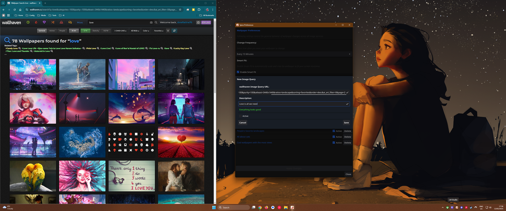

<!-- markdownlint-disable MD033 MD041 -->

<h1 align="center">Spice - Spice Up Your Desktop 🌶️</h1>

  
  
  
  
  
  

Spice is a minimalist wallpaper manager that automatically cycles high-quality wallpapers from Wallhaven, Pexels, curated museum collections, your personal Google Photos, and Wikimedia Commons. It runs quietly in the background, keeping your workspace fresh without interrupting your flow.

**Note:** Spice lives in your **Windows system tray** or **macOS menu bar**, giving you instant control over your desktop environment.

  

## ✨ Key Features

### 🌎 Infinite Sources
*   **🔗 Browser Companion:** Use our [**Chrome Extension**](https://chromewebstore.google.com/detail/ekodikedjmhnganfcfleabcfohdjkoeb) or [**Firefox Add-on**](https://addons.mozilla.org/en-US/firefox/addon/spice-wallpaper-manager/) to seamlessly send any image from the web to your desktop.
*   **🏛️ The Museum Experience:** Turn your desk into a gallery with 4K+ Open Access masterpieces from **The Met** and **Art Institute of Chicago**.
*   **📸 Curated Sources:** Native support for **Wallhaven**, **Pexels**, and **Wikimedia Commons**.
*   **☁️ Personal Collections:** Seamlessly cycle your own memories with **Google Photos** integration.
*   **❤️ Local Favorites:** Build your own curated collection that works offline.

### 🧠 Smart Technology
*   **📏 Smart Fit 2.0:**
    *   **Quality Mode (Strict):** Ensures perfect composition by rejecting images that don't fit your screen, unless a clear face is detected.
    *   **Flexibility Mode:** Accepts high-res images with a "Safe Fallback" for ultrawide monitors.
    *   **Face Boost:** Ensures people are perfectly framed.
*   **⚡ Ultra-Responsive:** Engineered for zero-lag performance, ensuring the UI stays snappy even while handling high-resolution 4K content.
*   **🖥️ Independent Multi-Monitor Suite:** Spice v2.0 detects every connected display and assigns it an autonomous controller. Every monitor can be controlled individually via dedicated hotkeys.
*   **📐 Orientation Intelligence:** Spice understands the difference between landscape and portrait monitors. It picks images that match your screen's orientation before applying **SmartCrop**, so your vertical monitors get true portrait compositions.
*   **🍃 Organic Staggering:** Optionally stagger wallpaper updates with randomized delays to prevent a sudden "flash" across all your monitors simultaneously.

### 🎮 Control & Experience
*   **⌨️ Global Hotkeys:** Control Spice instantly from anywhere.

#### Targeted Actions (Single Monitor)
Target a specific monitor (**1-9**) by holding that number key while pressing the shortcut. Defaults to **Display 1** if no number is held.

| Action | macOS Shortcut | Windows Shortcut |
| :--- | :--- | :--- |
| **Next Wallpaper** | `Command` + `1-9` + `→` | `Alt` + `1-9` + `→` |
| **Prev Wallpaper** | `Command` + `1-9` + `←` | `Alt` + `1-9` + `←` |
| **Fav / Unfav** | `Command` + `1-9` + `↑` | `Alt` + `1-9` + `↑` |
| **Del + Block** | `Command` + `1-9` + `↓` | `Alt` + `1-9` + `↓` |
| **Pause Play** | `Command` + `1-9` + `P` | `Alt` + `1-9` + `P` |

#### Global Actions (All Monitors)
These actions affect all displays simultaneously.

| Action | macOS Shortcut | Windows Shortcut |
| :--- | :--- | :--- |
| **Next (All Displays)** | `Cmd + Ctrl + →` | `Ctrl + Alt + →` |
| **Previous (All Displays)** | `Cmd + Ctrl + ←` | `Ctrl + Alt + ←` |
| **All Settings** | `Cmd + Ctrl + O` | `Ctrl + Alt + O` |
| **Global Sync** | `Cmd + Ctrl + D` | `Ctrl + Alt + D` |
 
 > [!TIP]
> **Shortcut Conflicts:** If these hotkeys conflict with your browser (e.g., `Alt + Arrow` on Windows or `Cmd + Arrow` on macOS for navigation) or other apps, you can disable **Global** or **Targeted** shortcuts independently in the **App** settings.
 
 > [!IMPORTANT]
> **macOS Permissions:** Display-specific (chorded) hotkeys require **Accessibility** or **Input Monitoring** permissions to detect the number keys correctly. Go to *System Settings > Privacy & Security* to enable them for Spice.
*   **🏷️ Instant Attribution:** See the artist/photographer name via the tray menu in real-time.
*   **⏯️ Per-Display Pause:** Pause rotation on a specific monitor while keeping others moving, or stop all rotation via the "Never" frequency setting.
*   **⛔ Blocklist:** Trash a wallpaper once, and it's gone forever.

## 📚 Documentation

* **User Guide:** For a comprehensive look at all settings and features, see our [**Detailed User Guide**](docs/user_guide.md).
* **Architecture:** Curious how Spice works under the hood? Read our [**Architecture Documentation**](docs/architecture.md) for a deep dive into our hybrid concurrency model and actor-based multi-monitor management.
* **New Providers:** Want to add your own wallpaper source? Check out our [**Provider Creation Guide**](docs/creating_new_providers.md) to learn how to implement the `ImageProvider` interface in minutes.
* **New Plugins:** Want to extend Spice with completely new features? Read our [**Plugin Development Guide**](docs/creating_new_plugins.md).

## 📦 Installation

Head to the [**Releases Page**](https://github.com/dixieflatline76/Spice/releases/latest) to download the installer for your OS.

### 🌐 Browser Companion Extension

*   **Chrome / Brave / Edge:** [**Install from Chrome Web Store**](https://chromewebstore.google.com/detail/ekodikedjmhnganfcfleabcfohdjkoeb)
*   **Firefox:** [**Install from Firefox Add-ons**](https://addons.mozilla.org/en-US/firefox/addon/spice-wallpaper-manager/)
*   **Safari:** Included in the macOS App.

### For Windows

1.  Download `Spice-Setup-x.y.z-amd64.exe`.
2.  Double-click to install.
3.  *(Optional)* Find the **Spice Chrome Extension** on the [**Chrome Web Store**](https://chromewebstore.google.com/detail/ekodikedjmhnganfcfleabcfohdjkoeb) and click **Add to Chrome**.

### For macOS (Apple Silicon)

1.  Download `Spice-vx.y.z-arm64.dmg`.
2.  Open the `.dmg`.
3.  Drag **Spice.app** into your **Applications** folder.
4.  *(Optional)* Drag **Spice Wallpaper Manager Extension.app** into your **Applications** folder if you want Safari support.
5.  **Enable the Safari Extension:**
    *   Open Safari Settings > Extensions.
    *   Check the box for **Spice Wallpaper Manager**.
    *   Click "Always Allow on Every Website" to ensure seamless detection.

## 🚀 Usage

For a comprehensive walkthrough of all features, keyboard shortcuts, and configuration options, please refer to the [**Detailed User Guide**](docs/user_guide.md).

### Tips

* **Wallhaven Favorites:** To use your private collection, use the URL format with your User ID: `https://wallhaven.cc/user/<username>/favorites/<id>`, rather than the generic favorites link.
* **Disable Local Favorites:** To turn off the "Favorite Images" provider, simply uncheck the "Active" box next to its query in the **Spice Preferences** > **Wallpaper** tab.

## 🔮 Roadmap

We have big plans for Spice!

* **Linux & Intel Mac Support:** While we currently focus on Apple Silicon (arm64), we plan to expand our official builds to Intel Macs and Linux.
* **More Providers:** Adding support for other wallpaper sources like **Pixabay**, **Cleveland Museum of Art**, and the **Rijksmuseum** (Amsterdam).
* **Local Collections:** Point Spice to any folder on your computer to use your existing wallpaper library.
* **Customizable Keyboard Shortcuts:** Full control over modifier keys and hotkey combinations to avoid OS-level conflicts.

## ⚠️ Known Limitations

* **Blocklist Editing:** You can currently reset the whole blocklist, but removing single images is coming soon.

## 💬 Feedback

Found a bug or have an idea? Please open an issue on [GitHub](https://github.com/dixieflatline76/Spice/issues).

---

<a href="privacy.html">Privacy Policy</a> | PolyForm Noncommercial 1.0.0 - Copyright (c) 2026 Karl Kwong

