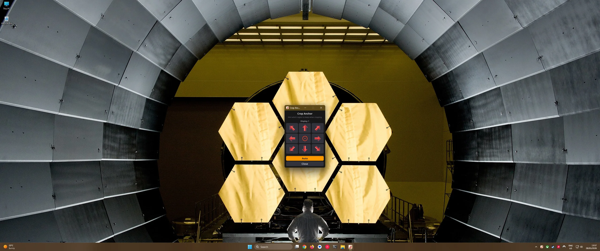

<!-- markdownlint-disable MD033 MD041 -->
<p align="center"></p>

<h1 align="center">Spice 🌶️ | A highly-concurrent, plugin-driven desktop environment engine for macOS and Windows, written in Go.</h1>

<p align="center">
  <a href="https://github.com/dixieflatline76/Spice/actions/workflows/ci.yml"></a>
  <a href="https://pkg.go.dev/github.com/dixieflatline76/Spice/v2"></a>
  <a href="LICENSE"></a>
  <a href="https://github.com/dixieflatline76/Spice/releases/latest"></a>
  <a href="https://chromewebstore.google.com/detail/ekodikedjmhnganfcfleabcfohdjkoeb"></a>
  <a href="https://addons.mozilla.org/en-US/firefox/addon/spice-wallpaper-manager/"></a>
</p>

Spice is a premium wallpaper manager that automatically cycles high-quality wallpapers from Wallhaven, Pexels, curated museum collections, your personal Google Photos, and Wikimedia Commons. It is available on the **Mac App Store** and **Microsoft Store** and runs quietly in the background, keeping your workspace fresh without interrupting your flow.

**Note:** Spice lives in your **Windows system tray** or **macOS menu bar**, giving you instant control over your desktop environment.

<p align="center">
  
</p>

## ⚙️ Built for Performance (A Modular Engine)

Spice isn't just a basic script; it's a high-performance, multi-threaded desktop engine written in Go.

*   **Zero UI Lag:** Heavy 4K image processing is completely separated from the user interface, meaning the app stays lightning-fast even under heavy loads.
*   **True Multi-Monitor:** Each of your displays is managed independently in the background, meaning rotation on one screen will never block or freeze another.
*   **Plugin-Ready:** Built with a modular architecture that allows new museum integrations, custom preference panels, and tray menus to be safely plugged into the core engine.

## ✨ Key Features

### 🌎 Infinite Sources
*   **🔗 Browser Companion:** Use our [**Chrome Extension**](https://chromewebstore.google.com/detail/ekodikedjmhnganfcfleabcfohdjkoeb) or [**Firefox Add-on**](https://addons.mozilla.org/en-US/firefox/addon/spice-wallpaper-manager/) to seamlessly send any image from the web to your desktop.
*   **🏛️ The Museum Experience:** Turn your desk into a gallery with 4K+ Open Access masterpieces from **The Met**, **Art Institute of Chicago**, **Cleveland Museum of Art**, the **Rijksmuseum** (Amsterdam), the **National Palace Museum** (Taiwan), **Statens Museum for Kunst** (Denmark), and **Getty Images**.
    *   **Offline Salon Galleries:** Browse curated collections directly in your browser with our stunning, locally-generated masonry preview galleries—available offline with a single click from the preferences panel.
*   **📸 Curated Sources:** Native support for **Wallhaven**, **Pexels**, and **Wikimedia Commons**.
*   **☁️ Personal Collections:** Seamlessly cycle your own memories with **Google Photos** integration.
*   **📁 Local Folders:** Point Spice to any directory on your computer to use your existing wallpaper library.
*   **❤️ Local Favorites:** Build your own curated collection that works offline.

### 🧠 Smart Technology
*   **📏 Smart Fit 2.0:** A custom heuristic pipeline utilizing `pigo` cascade detection and luminance entropy calculations to override strict aspect-ratio gates.
    *   **Quality Mode (Strict):** Ensures perfect composition by rejecting images that don't fit your screen, unless a clear face is detected.
    *   **Flexibility Mode:** Accepts high-res images with a "Safe Fallback" for ultrawide monitors.
*   **🧑‍🤝‍🧑 Face Boost:** Uses confidence-weighted scaling to ensure subjects are perfectly framed without zooming in on phantom shadows or knees.
*   **⚡ Ultra-Responsive:** Engineered for zero-lag performance, ensuring the UI stays snappy even while handling high-resolution 4K content.
*   **🖥️ Independent Multi-Monitor Suite:** Spice v2.0 detects every connected display and assigns it an autonomous controller. Every monitor can be controlled individually via dedicated hotkeys.
*   **📐 Orientation Intelligence:** Spice understands the difference between landscape and portrait monitors. It picks images that match your screen's orientation before applying **SmartCrop**, so your vertical monitors get true portrait compositions.
*   **🖼️ Virtual Museum Frame:** Display the entire uncropped image on a generated background. Automatically rescues extreme portraits and landscapes by framing them instead of cropping, preserving the original aspect ratio.
*   **🎯 Tune Image:** Open the Tune Image popup to hint which region to keep when cropping using a 9-direction anchor grid, or manually enable the Virtual Museum Frame to adjust frame size, paper matting, and wall color.
*   **🍃 Organic Staggering:** Handled via decentralized monitor Actor loops to prevent sudden CPU spikes across all displays.

### 🎮 Control & Experience
*   **⌨️ Global Hotkeys:** Control Spice instantly from anywhere.
*   **🌐 Multilingual Support:** Fully localized in 12 languages (English, German, Spanish, French, Italian, Portuguese, Japanese, Russian, Ukrainian, Chinese Simplified, and Chinese Traditional).

#### Targeted Actions (Single Monitor)
Target a specific monitor (**1-9**) by holding that number key while pressing the shortcut. Defaults to **Display 1** if no number is held.

| Action | macOS Shortcut | Windows Shortcut |
| :--- | :--- | :--- |
| **Next Wallpaper** | `Command` + `1-9` + `→` | `Alt` + `1-9` + `→` |
| **Prev Wallpaper** | `Command` + `1-9` + `←` | `Alt` + `1-9` + `←` |
| **Fav / Unfav** | `Command` + `1-9` + `↑` | `Alt` + `1-9` + `↑` |
| **Del + Block** | `Command` + `1-9` + `↓` | `Alt` + `1-9` + `↓` |
| **Pause Play** | `Command` + `1-9` + `P` | `Alt` + `1-9` + `P` |
| **Shuffle** | `Command` + `1-9` + `R` | `Alt` + `1-9` + `R` |
| **Info** | `Command` + `1-9` + `I` | `Alt` + `1-9` + `I` |
| **Tune Up** | `Command` + `1-9` + `W` | `Alt` + `1-9` + `W` |
| **Tune Down** | `Command` + `1-9` + `S` | `Alt` + `1-9` + `S` |
| **Tune Left** | `Command` + `1-9` + `A` | `Alt` + `1-9` + `A` |
| **Tune Right** | `Command` + `1-9` + `D` | `Alt` + `1-9` + `D` |
| **Tune Center** | `Command` + `1-9` + `E` | `Alt` + `1-9` + `E` |
| **Tune Auto** | `Command` + `1-9` + `Q` | `Alt` + `1-9` + `Q` |

#### Global Actions (All Monitors)
These actions affect all displays simultaneously.

| Action | macOS Shortcut | Windows Shortcut |
| :--- | :--- | :--- |
| **Next (All Displays)** | `Cmd + Ctrl + →` | `Ctrl + Alt + →` |
| **Previous (All Displays)** | `Cmd + Ctrl + ←` | `Ctrl + Alt + ←` |
| **Shuffle (All Displays)** | `Cmd + Ctrl + R` | `Ctrl + Alt + R` |
| **Info (Primary Display)** | `Cmd + Ctrl + I` | `Ctrl + Alt + I` |
| **All Settings** | `Cmd + Ctrl + O` | `Ctrl + Alt + O` |
| **Global Sync** | `Cmd + Ctrl + D` | `Ctrl + Alt + D` |
 
 > [!TIP]
> **Shortcut Conflicts:** If these hotkeys conflict with your browser (e.g., `Alt + Arrow` on Windows or `Cmd + Arrow` on macOS for navigation) or other apps, you can disable **Global** or **Targeted** shortcuts independently in the **App** settings.
 
 > [!IMPORTANT]
> **macOS Permissions:** Display-specific (chorded) hotkeys require **Accessibility** or **Input Monitoring** permissions to detect the number keys correctly. Go to *System Settings > Privacy & Security* to enable them for Spice.
*   **🏷️ Instant Attribution:** See the artist/photographer name via the tray menu in real-time.
*   **⏯️ Per-Display Pause:** Pause rotation on a specific monitor while keeping others moving, or stop all rotation via the "Never" frequency setting.
*   **⛔ Blocklist:** Trash a wallpaper once, and it's gone forever.

## 📚 Documentation

* **User Guide:** For a comprehensive look at all settings and features, see our [**Detailed User Guide**](docs/user_guide.md).
* **Architecture:** Curious how Spice works under the hood? Read our [**Architecture Documentation**](docs/architecture.md) for a deep dive into the data flow and actor-based multi-monitor management.
* **Developer Context:** For concurrency rules, lock hierarchy, and implementation constraints, see the [**Internal Developer Guide**](docs/internal_developer_context.md).
* **New Providers:** Want to add your own wallpaper source? Check out our [**Provider Creation Guide**](docs/creating_new_providers.md) to learn how to implement the `ImageProvider` interface in minutes.
* **New Plugins:** Want to extend Spice with completely new features? Read our [**Plugin Development Guide**](docs/creating_new_plugins.md).

## 📦 Installation

### For macOS
The easiest way to install Spice is via Homebrew:
```bash
brew install --cask spice
```
*Alternatively, download the `.dmg` from the [Releases Page](https://github.com/dixieflatline76/Spice/releases/latest).*

### For Windows
Install directly from the [**Microsoft Store**](https://apps.microsoft.com/detail/9NPBQ3C91WPF).

Alternatively, install silently via Winget:
```powershell
winget install DixieFlatline76.Spice
```

### 🌐 Browser Companion Extension

*   **Chrome / Brave / Edge:** [**Install from Chrome Web Store**](https://chromewebstore.google.com/detail/ekodikedjmhnganfcfleabcfohdjkoeb)
*   **Firefox:** [**Install from Firefox Add-ons**](https://addons.mozilla.org/en-US/firefox/addon/spice-wallpaper-manager/)
*   **Safari:** Included in the macOS App.

## 🚀 Usage

For a comprehensive walkthrough of all features, keyboard shortcuts, and configuration options, please refer to the [**Detailed User Guide**](docs/user_guide.md).

### 🔑 Developer Setup & Secrets

Note: The compiled App Store releases include production OAuth credentials. If you are building from source, you must provide your own API keys (e.g., Google GCP, Pexels, Wikimedia) via a `.spice_secrets` file. See the included `load_secrets` scripts for details.

### Tips

* **Wallhaven Favorites:** To use your private collection, use the URL format with your User ID: `https://wallhaven.cc/user/<username>/favorites/<id>`, rather than the generic favorites link.
* **Disable Local Favorites:** To turn off the "Favorite Images" provider, simply uncheck the "Active" box next to its query in the **Spice Preferences** > **Wallpaper** tab.

## 🔮 Roadmap

We have big plans for Spice!

* **Linux & Intel Mac Support:** While we currently focus on Apple Silicon (arm64), we plan to expand our official builds to Intel Macs and Linux.
* **More Providers:** Adding support for other wallpaper sources like **Pixabay**.
* **Customizable Keyboard Shortcuts:** Full control over modifier keys and hotkey combinations to avoid OS-level conflicts.

## ⚠️ Known Limitations

* **Blocklist Editing:** You can currently reset the whole blocklist, but removing single images is coming soon.

## 💬 Feedback

Found a bug or have an idea? Please open an issue on [GitHub](https://github.com/dixieflatline76/Spice/issues).

---
<p align="center"><a href="privacy.html">Privacy Policy</a> | PolyForm Noncommercial 1.0.0 - Copyright (c) 2026 Karl Kwong</p>
