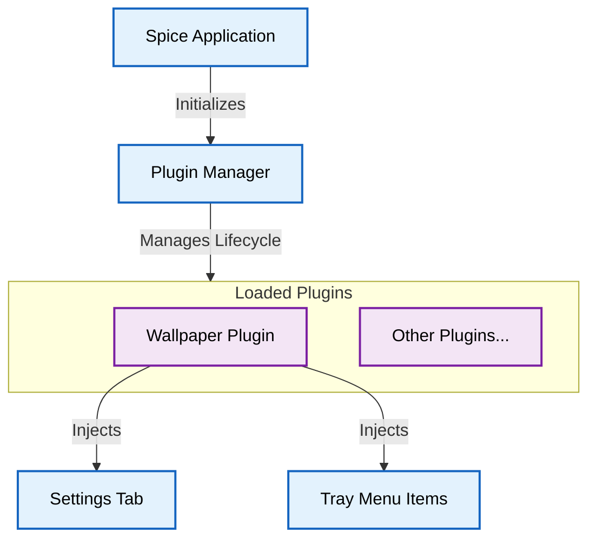
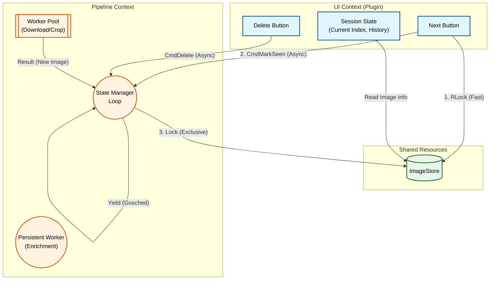
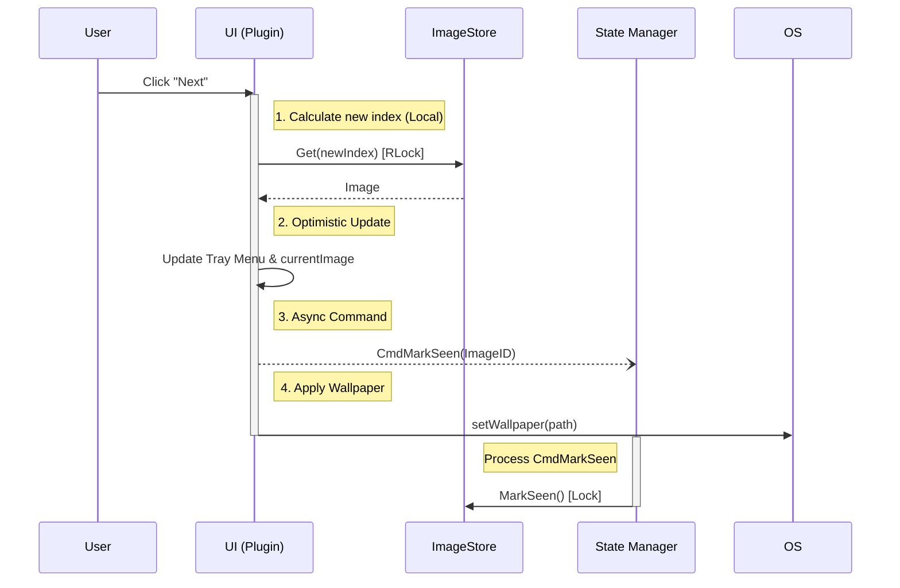
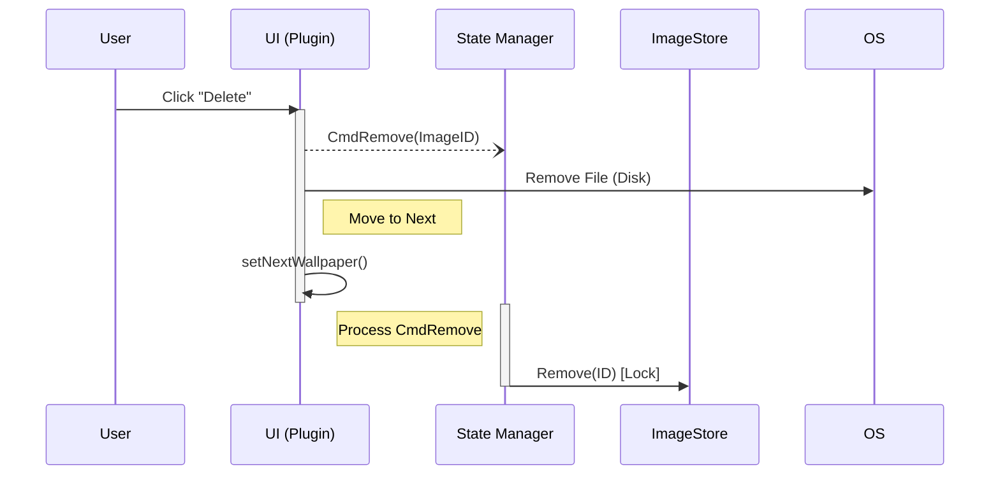

# Spice Architecture Documentation (Wallpaper Plugin)

> **Status**: Current as of v1.6.5
> **Focus**: Concurrency Model, Image Pipeline, and UI Synchronization

## 1. Executive Summary

Spice employs a **Single-Writer, Multiple-Reader (SWMR)** concurrency architecture to separate resource-intensive operations (image processing, I/O) from the user interface. This design eliminates UI main-thread blocking ("jank") and lock contention, ensuring a buttery-smooth user experience even during heavy background downloads.

## 2. System Architecture (Plugin System)

Spice is built as a modular application where core functionality is delivered via plugins.

## 3. Wallpaper Plugin Architecture

### 3.1 Core Concepts

#### 3.1.1 The Single-Writer Principle

To prevent race conditions and lock contention, **only one** goroutine is allowed to mutate the global state (Image Store). All other components, including the UI, are **Readers** or **Command Senders**.

#### 3.1.2 Decoupled UI Session

The User Interface maintains its own **local session state** (which image am I looking at right now?). It strictly reads from the shared store and sends asynchronous commands to request changes.

## 3.2 High-Level Architecture

The system is divided into two distinct execution contexts:

1. **The UI Context (Main Thread)**: Handles user input, rendering, and navigation. It is optimized for **Read Speed**.
2. **The Pipeline Context (Background)**: Handles downloading, processing, and state mutation. It is optimized for **Throughput**.

## 3.3 Component Details

### 4.1 ImageStore (`pkg/wallpaper/store.go`)

A thread-safe, stateless container.

- **Role**: The "Database" of the application.
- **Locking**: Uses `sync.RWMutex`.
  - **Reads (Next Button)**: Uses `RLock()` (Non-blocking).
  - **Writes (Download/MarkSeen)**: Uses `Lock()` (Exclusive).
  - **Persistence**: Debounced (2s) and uses `RLock()` to save to disk without blocking readers.
- **Constraints**: Contains no iteration logic (no `currentIndex`).

### 4.2 Pipeline State Manager (`pkg/wallpaper/pipeline.go`)

The "Brain" of the backend.

- **Role**: Consumes results from workers and commands from the UI.
- **Behavior**:
  - Loops continuously selecting on `resultChan` and `cmdChan`.
  - Acquires Write Lock -> Mutates Store -> Releases Lock.
  - **Yields**: Calls `runtime.Gosched()` after every operation to prevent starving readers.

### 4.3 UI Plugin (`pkg/wallpaper/wallpaper.go`)

The "Controller".

- **Role**: Manages the user session and optimistic UI updates.
- **Key Logic**:
  - **Navigation**: Calculates next index locally, reads from store.
  - **Optimistic Updates**: Updates Tray Menu *before* calling blocking OS wallpaper functions.
  - **Rollback**: If OS call fails, reverts UI to previous state.

### 4.4 Lazy Enrichment Worker (`startEnrichmentWorker`)

A persistent, single-goroutine worker that "pivots" to the user's current location.

- **Role**: Fetches metadata (Enrichment) for upcoming images.
- **Behavior**:
  - Listens on `enrichmentSignal` (buffered channel).
  - When user navigates, instantly aborts current look-ahead and jumps to new index.
  - Ensures metadata is ready *just in time*, reducing API waste.

## 3.4 Interaction Flows

### 3.4.1 "Next Wallpaper" Flow (Zero Contention)

This flow demonstrates how the UI updates instantly without waiting for a write lock.

### 3.4.2 "Delete Wallpaper" Flow

Deleting requires modifying the store, handled asynchronously.

## 3.5 Directory Structure & Key Files

| Component | File Path | Responsibility |
| :--- | :--- | :--- |
| **Store** | `pkg/wallpaper/store.go` | Data repository. RWMutex protected. |
| **Pipeline** | `pkg/wallpaper/pipeline.go` | Worker pool & State Manager Loop. |
| **Controller**| `pkg/wallpaper/wallpaper.go` | UI logic, Lifecycle, Optimistic Updates. |
| **Processor** | `pkg/wallpaper/smart_image_processor.go` | Face detection, cropping (Heavy CPU). |

## 3.5 Resource Management

### 3.5.1 Deep Cache Cleaning (Recursive Deletion)

Spice implements a strict "Zero Orphans" policy for resource management. When a wallpaper collection (Query) is deleted:

1.  **Configuration Callback**: The `Config` triggers a registered callback (`onQueryRemoved`).
2.  **Store Pruning**: The callback invokes `store.RemoveByQueryID(queryID)`.
3.  **Deep Delete**: The File Manager's `DeepDelete` function is called for every image ID:
    - Deletes the **Master Image**.
    - recursively deletes all **Derivatives** (Smart Fit, Face Crop, Face Boost images) in their respective subdirectories.

### 3.5.2 Provider Strategies

Spice supports two distinct provider interaction models:

*   **API Fetch (Standard)**:
    *   **Examples**: Wallhaven, Pexels.
    *   **Flow**: Query API -> Get URLs -> Download One-by-One on demand.
    *   **State**: Ephemeral. Images are only downloaded when viewed (or pre-fetched).

*   **Import / Pick (Google Photos)**:
    *   **Example**: Google Photos.
    *   **Flow**: Launch Picker -> Select N Items -> Bulk Download Immediately to `cache/google_photos/<GUID>`.
    *   **State**: Local. The provider acts as a local file scanner over the imported directory.
    *   **Cleanup**: Deleting the collection deletes the entire backing folder.

### 3.5.3 Provider Categorization

To manage the growing number of providers, Spice categorizes them into three distinct types (`provider.ProviderType`), which dictates their UI placement:

*   **TypeOnline**: Remote APIs (Unsplash, Pexels). Placed in the "Online" tab working via network fetch.
*   **TypeLocal**: Local filesystem interactions (Favorites, Local Files). Placed in the "Local" tab.
*   **TypeAI**: Generative or logical providers. Placed in the "AI" tab (Future).

- **Events**: The `cmdChan` pattern can be expanded to a full Event Bus if the application grows complexity (e.g., specific event subscribers).

## 3.7 Performance Strategies

To maintain responsiveness under load, the following optimizations are employed:

1. **O(1) Image Store**: The store uses a secondary `idSet map[string]bool` to perform existence checks in constant time (45ns) rather than linear scans (470ns+), ensuring that the Writer Loop never lags even with thousands of images.
2. **Synchronous Race Prevention**: The Controller synchronously anticipates background work (setting `isDownloading = true` under lock) *before* spawning goroutines. This prevents "job storms" and CPU saturation during rapid UI interactions.

## 3.8 Smart Fit Algorithm
Spice uses a "Holistic Imaging" approach that combines Face Detection (Pigo), Entropy Analysis (SmartCrop), and Composition Rules.

*   **Face Rescue**: High-quality images with incorrect aspect ratios are "Rescued" only if a dominant face is detected, ensuring we never crop heads.
*   **Feet Guard**: A heuristic that prevents the cropper from selecting the bottom 20% of an image (usually shoes/legs) unless the image has "High Energy" (complex texture).
*   **Tuning**: All heuristic parameters are externalized in `pkg/wallpaper/tuning.go` to separate logic from magic numbers.

## 3.9 The "Git-Driven" Content System
For verified providers (Museums), Spice treats `raw.githubusercontent.com` as a Content Delivery Network (CDN).
*   **Architecture**: `Remote > Cache > Embed > Hardcoded`.
*   **Benefit**: Allows instant curation updates (adding new artworks to "Director's Cut") without requiring users to download a binary update.

<!-- Mermaid JS Handling -->

