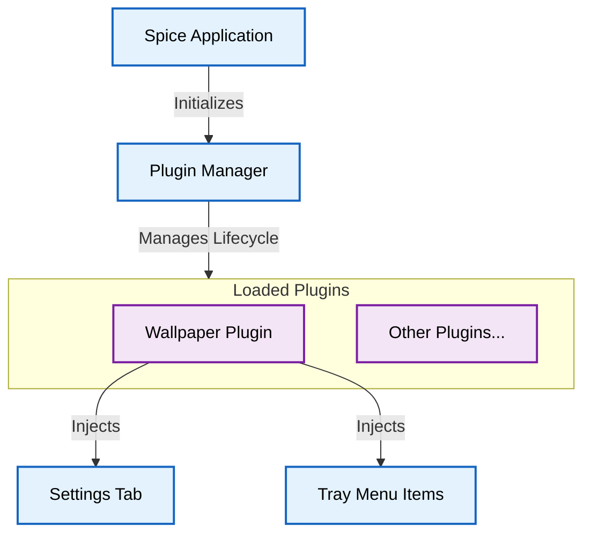
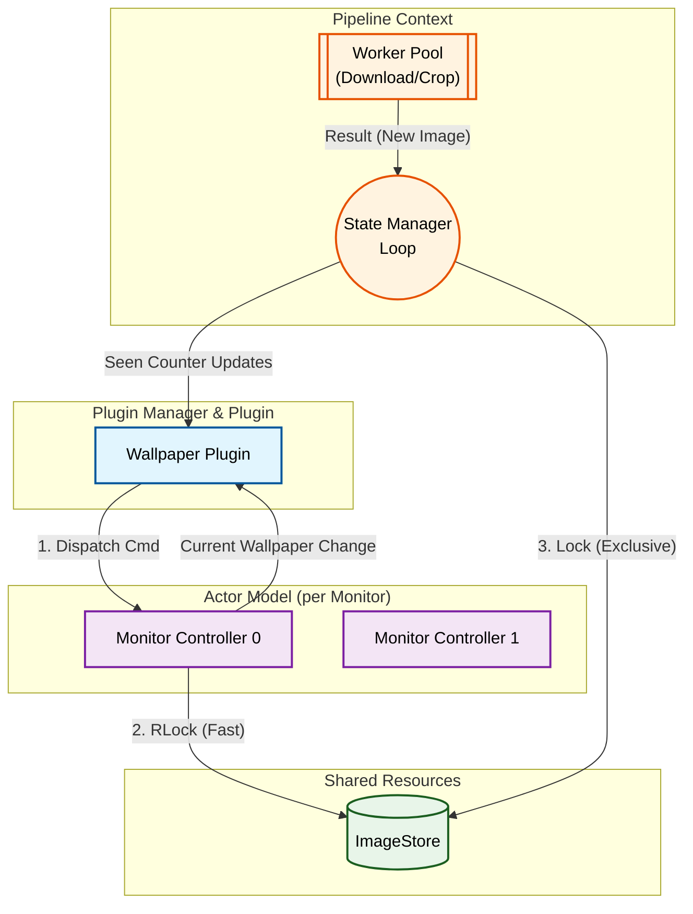
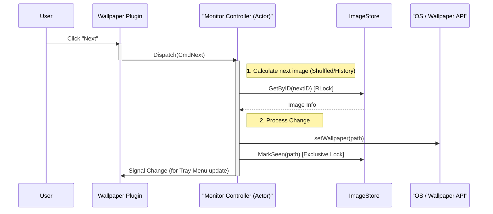
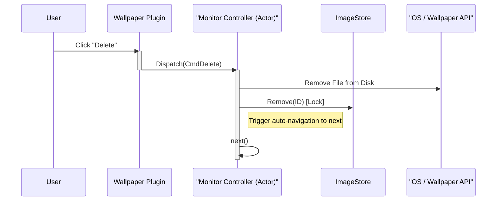
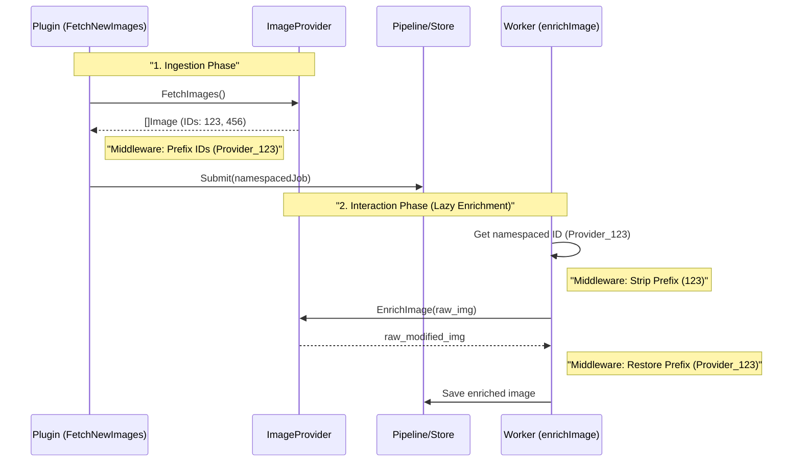

# Spice Architecture Documentation (Wallpaper Plugin)

> **Status**: Current as of v2.5.1 (Concurrency Model Audit)
> **Focus**: Concurrency Model, Image Pipeline, and Actor-based Display Management

## 1. Executive Summary

Spice employs a **hybrid concurrency architecture** to separate resource-intensive operations (image processing, I/O) from the user interface. The performance-critical **hot path** (image download, processing, and ingestion) is serialized through a **single-writer pipeline**, while infrequent **administrative operations** (favorites, cache clearing, reconciliation) use direct **mutex-protected** store access. This design eliminates UI main-thread blocking ("jank") and ensures a responsive user experience even during heavy background downloads.

## 2. System Architecture (Plugin System)

Spice is built as a modular application where core functionality is delivered via plugins.

```mermaid
graph TD
    classDef core fill:#e3f2fd,stroke:#1565c0,stroke-width:2px,color:#000,font-size:16px;
    classDef plug fill:#f3e5f5,stroke:#7b1fa2,stroke-width:2px,color:#000,font-size:16px;

    App[Spice Application]:::core
    PM[Plugin Manager]:::core
    
    subgraph Plugins ["Loaded Plugins"]
        WP[Wallpaper Plugin]:::plug
        Other[Other Plugins...]:::plug
    end

    App -->|Initializes| PM
    PM -->|Manages Lifecycle| Plugins
    
    WP -->|Injects| SettingsUI[Settings Tab]:::core
    WP -->|Injects| TrayUI[Tray Menu Items]:::core
```

## 3. Wallpaper Plugin Architecture

### 3.1 Core Concepts

#### 3.1.1 The Pipeline-Serialized Hot Path

On the performance-critical hot path (image ingestion from workers), mutations are serialized through a **single pipeline goroutine** (`stateManagerLoop`). This eliminates lock contention during high-throughput operations like bulk downloading.

#### 3.1.2 Mutex-Protected Admin Operations

Infrequent administrative operations (toggling favorites, cache clearing, startup reconciliation, query removal) mutate the store directly under `sync.RWMutex`. These operations are inherently synchronous — a user clicks "Clear Cache" and the store must be updated before the UI refreshes.

#### 3.1.3 Decoupled UI Session

The User Interface maintains its own **local session state** (which image am I looking at right now?). It strictly reads from the shared store and sends asynchronous commands to request changes.

## 3.2 High-Level Architecture

The system is divided into two distinct execution contexts:

1. **The UI Context (Main Thread)**: Handles user input, rendering, and navigation. It is optimized for **Read Speed**.
2. **The Pipeline Context (Background)**: Handles downloading, processing, and state mutation. It is optimized for **Throughput**.

```mermaid
graph TD
    classDef ui fill:#e1f5fe,stroke:#01579b,stroke-width:2px,color:#000,font-size:16px;
    classDef actor fill:#f3e5f5,stroke:#7b1fa2,stroke-width:2px,color:#000,font-size:16px;
    classDef pipe fill:#fff3e0,stroke:#e65100,stroke-width:2px,color:#000,font-size:16px;
    classDef store fill:#e8f5e9,stroke:#1b5e20,stroke-width:2px,color:#000,font-size:16px;

    subgraph UI_Orchestration ["Plugin Manager & Plugin"]
        Plugin[Wallpaper Plugin]:::ui
    end

    subgraph Actor_Layer ["Actor Model (per Monitor)"]
        Monitor1[Monitor Controller 0]:::actor
        Monitor2[Monitor Controller 1]:::actor
    end

    subgraph Shared_Resource ["Shared Resources"]
        Store[(ImageStore)]:::store
    end

    subgraph Pipeline_Layer ["Pipeline Context"]
        Workers[["Worker Pool<br/>(Download/Crop)"]]:::pipe
        Manager(("State Manager<br/>Loop")):::pipe
    end

    %% Interaction Flows
    Plugin -- "1. Dispatch Cmd" --> Monitor1
    Monitor1 -- "2. RLock (Fast)" --> Store
    
    Workers -- "Result (New Image)" --> Manager
    Manager -- "3. Lock (Exclusive)" --> Store
    
    %% Feedback
    Manager -- "Seen Counter Updates" --> Plugin
    Monitor1 -- "Current Wallpaper Change" --> Plugin
```

## 3.3 Component Details

### 3.3.1 The Monitor Controller (Actor Pattern)
*Added in v2.0*

To support independent multi-monitor wallpapers, Spice moved from a single-controller model to an **Actor Model**.

-   **Role**: An autonomous agent responsible for **one** specific display.
-   **Isolation**: Each monitor has its own:
    -   **State**: Current Image, History Stack, Shuffle Permutation (`ShuffleIDs`, `RandomPos`).
    -   **Command Loop**: A dedicated goroutine that `select`s on a `Commands` channel.
-   **Behavior**:
    -   Receives high-level commands (`CmdNext`, `CmdPrev`, `CmdUpdateShuffle`) from the central Plugin.
    -   Executes logic locally (e.g., calculating the next random index).
    -   Applies the wallpaper *only* to its assigned screen.
-   **Benefit**: User interaction on Monitor 1 (e.g., browsing history) is completely decoupled from Monitor 2.

### 4.1 ImageStore (`pkg/wallpaper/store.go`)

A thread-safe, stateless container.

- **Role**: The "Database" of the application.
- **Locking**: Uses `sync.RWMutex`.
  - **Reads (Next Button)**: Uses `RLock()` (Non-blocking).
  - **Writes (Download/MarkSeen)**: Uses `Lock()` (Exclusive).
  - **Persistence**: Debounced (2s) and uses `RLock()` to save to disk without blocking readers.
- **Constraints**: Contains no iteration logic (no `currentIndex`).
- **Writers**: The store is written to by two categories of caller:
  - **Pipeline (hot path)**: `Add`, `MarkSeen`, `Remove`, `Clear` — serialized through `stateManagerLoop`.
  - **Plugin (admin ops)**: `Update`, `Remove`, `RemoveByQueryID`, `ResetFavorites`, `Wipe`, `Sync` — called directly under mutex from the Plugin for user-initiated or startup operations.

### 4.2 Pipeline State Manager (`pkg/wallpaper/pipeline.go`)

The serialized writer for the **hot path**.

- **Role**: Consumes results from workers and commands from the UI.
- **Behavior**:
  - Loops continuously selecting on `resultChan` and `cmdChan`.
  - Acquires Write Lock -> Mutates Store -> Releases Lock.
  - **Yields**: Calls `runtime.Gosched()` after every operation to prevent starving readers.
- **Scope**: Handles `Add` (from workers), `MarkSeen`, `Remove`, and `Clear` (from command channel). Does **not** handle admin operations like favorites management or query cleanup, which are performed directly by the Plugin.

### 4.3 UI Plugin (`pkg/wallpaper/wallpaper.go`)

The "Controller".

- **Role**: Manages the user session and optimistic UI updates.
- **Key Logic**:
  - **Navigation**: Calculates next index locally, reads from store.
  - **Optimistic Updates**: Updates Tray Menu *before* calling blocking OS wallpaper functions.
  - **Rollback**: If OS call fails, reverts UI to previous state.

### 4.4 Lazy Enrichment Worker (`startEnrichmentWorker`)

A persistent, single-goroutine worker that "pivots" to the user's current location.

- **Role**: Fetches metadata (Enrichment) for upcoming images.
- **Behavior**:
  - Listens on `enrichmentSignal` (buffered channel).
  - When user navigates, instantly aborts current look-ahead and jumps to new index.
  - Ensures metadata is ready *just in time*, reducing API waste.

### 4.5 Orchestrator & Provider Rate Limiting (Pipeline Concurrency)

To maximize download speeds while safely obeying strict third-party API limits, Spice uses a decoupled bulkhead architecture:

- **16 Generic Pipeline Workers**: The core orchestrator spawns 16 parallel workers that rapidly consume incoming image references.
- **`provider.PacedProvider` Interface**: If a provider implements this, the orchestrator routes the 16 workers through a strict `rate.Limiter`. This forces the parallel workers into a synchronized holding pattern, guaranteeing they only hit the external network at the provider's exact specified cadence (e.g. 1 API call per 2 seconds) eliminating HTTP 429 errors.
- **`provider.CustomClientProvider` Interface**: For exotic limit architectures (like ArtInstituteChicago's single-threaded serialized fetch requirements), providers can inject entirely custom `http.RoundTripper` pipelines that govern the 16 workers at the transport layer.

## 3.4 Interaction Flows

### 3.4.1 "Next Wallpaper" Flow (Zero Contention)

This flow demonstrates how the UI updates instantly without waiting for a write lock.

```mermaid
sequenceDiagram
    participant User
    participant Plugin as Wallpaper Plugin
    participant MC as "Monitor Controller (Actor)"
    participant Store as ImageStore
    participant OS as "OS / Wallpaper API"

    User->>Plugin: Click "Next"
    activate Plugin
    Plugin->>MC: Dispatch(CmdNext)
    deactivate Plugin
    
    activate MC
    Note right of MC: 1. Calculate next image (Shuffled/History)
    MC->>Store: GetByID(nextID) [RLock]
    Store-->>MC: Image Info
    
    Note right of MC: 2. Process Change
    MC->>OS: setWallpaper(path)
    MC->>Store: MarkSeen(path) [Exclusive Lock]
    MC->>Plugin: Signal Change (for Tray Menu update)
    deactivate MC
```

### 3.4.2 "Delete Wallpaper" Flow

Deleting requires modifying the store, handled asynchronously.

```mermaid
sequenceDiagram
    participant User
    participant Plugin as Wallpaper Plugin
    participant MC as "Monitor Controller (Actor)"
    participant Store as ImageStore
    participant OS as "OS / Wallpaper API"

    User->>Plugin: Click "Delete"
    activate Plugin
    Plugin->>MC: Dispatch(CmdDelete)
    deactivate Plugin
    
    activate MC
    MC->>OS: Remove File from Disk
    MC->>Store: Remove(ID) [Lock]
    Note right of MC: Trigger auto-navigation to next
    MC->>MC: next()
    deactivate MC
```

## 3.5 Directory Structure & Key Files

| Component | File Path | Responsibility |
| :--- | :--- | :--- |
| **Interfaces**| `pkg/wallpaper/interfaces.go`| Definitions for `JobSubmitter` and `StoreInterface`. |
| **Store** | `pkg/wallpaper/store.go` | Data repository. RWMutex protected. |
| **Pipeline** | `pkg/wallpaper/pipeline.go` | Worker pool & State Manager Loop. |
| **Actor** | `pkg/wallpaper/monitor_controller.go`| Monitor-specific state & logic. |
| **Controller**| `pkg/wallpaper/wallpaper.go` | Main plugin orchestrator & UI dispatch. |
| **Processor** | `pkg/wallpaper/smart_image_processor.go` | Face detection, cropping (Heavy CPU). |

## 3.5 Resource Management

### 3.5.1 Deep Cache Cleaning (Recursive Deletion)

Spice implements a strict "Zero Orphans" policy for resource management. When a wallpaper collection (Query) is deleted:

1.  **Configuration Callback**: The `Config` triggers a registered callback (`onQueryRemoved`).
2.  **Store Pruning**: The callback invokes `store.RemoveByQueryID(queryID)`.
3.  **Deep Delete (Wallhaven Reset Example)**: The File Manager's `DeepDelete` function is called for every image ID:
    - **Trigger**: Clicking "Clear API Key" for Wallhaven triggers a full account reset.
    - **Action**: All synced collection IDs are passed to the store for removal.
    - **Cleanup**: Recursively deletes the **Master Image** and all **Derivatives** (Smart Fit, Face Crop, etc.) in their respective subdirectories.

### 3.5.2 Provider Strategies

Spice supports two distinct provider interaction models:

*   **API Fetch (Standard)**:
    *   **Examples**: Wallhaven, Pexels.
    *   **Flow**: Query API -> Get URLs -> Download One-by-One on demand.
    *   **State**: Ephemeral. Images are only downloaded when viewed (or pre-fetched).

*   **Import / Pick (Google Photos)**:
    *   **Example**: Google Photos.
    *   **Flow**: Launch Picker -> Select N Items -> Bulk Download Immediately to `cache/google_photos/<GUID>`.
    *   **State**: Local. The provider acts as a local file scanner over the imported directory.
    *   **Cleanup**: Deleting the collection deletes the entire backing folder.

### 3.5.3 Provider Categorization

To manage the growing number of providers, Spice categorizes them into three distinct types (`provider.ProviderType`), which dictates their UI placement:

*   **TypeOnline**: Remote APIs (Pexels, Wallhaven). Placed in the "Online" tab working via network fetch.
*   **TypeLocal**: Local filesystem interactions (Favorites, Local Files). Placed in the "Local" tab.
*   **TypeAI**: Generative or logical providers. Placed in the "AI" tab (Future).

- **Events**: The `cmdChan` pattern can be expanded to a full Event Bus if the application grows complexity (e.g., specific event subscribers).

## 3.7 Performance Strategies

To maintain responsiveness under load, the following optimizations are employed:

1. **O(1) Image Store**: The store uses a secondary `idSet map[string]bool` to perform existence checks in constant time (45ns) rather than linear scans (470ns+), ensuring that the pipeline writer never lags even with thousands of images.
2. **Synchronous Race Prevention**: The Controller synchronously anticipates background work (setting `isDownloading = true` under lock) *before* spawning goroutines. This prevents "job storms" and CPU saturation during rapid UI interactions.
3. **Hot/Cold Path Separation**: Performance-critical writes (image ingestion from workers) are serialized through the pipeline to minimize lock contention. Administrative writes (favorites, cache clearing) go directly through the mutex — these are infrequent and benefit from synchronous completion rather than async queueing.

## 3.8 Smart Fit Algorithm (Strategy Pattern)
Spice's imaging engine (`pkg/wallpaper/smart_image_processor.go`) implements the **Strategy Pattern** to dynamically select the best cropping method based on image content and user settings.

*   **Strategies**:
    *   **`FaceCropStrategy`**: Used when a high-confidence face is found. Strictly crops around the face.
    *   **`EntropyCropStrategy`**: Uses SmartCrop (luminance/energy analysis) to find the most interesting area.
    *   **`SmartPanStrategy`**: Fallback for specific cases (e.g., "Face Boost" centering).
*   **Decision Logic**:
    *   **Face Rescue**: High-quality images with incorrect aspect ratios are "Rescued" only if a dominant face is detected.
    *   **Feet Guard**: A heuristic within `EntropyCropStrategy` preventing crops of the bottom 20% unless "High Energy" is detected.
    *   **Tuning**: Heuristic parameters are externalized in `pkg/wallpaper/tuning.go`.

## 3.10 Configuration Management (Migration Chain)
To manage evolving configuration schemas (e.g., legacy JSON formats, ID backfilling), Spice uses a **Chain of Responsibility** pattern.
*   **MigrationChain**: A sequence of `MigrationStep` functions (e.g., `UnifyQueriesStep`, `EnsureFavoritesStep`).
*   **Execution**: On startup, `loadFromPrefs` executes the chain. If any step modifies the config, a save is triggered automatically. This ensures data integrity across version upgrades.

## 3.11 UI State Management (The Registry Pattern)
*Added in v2.5*

To solve the "Closure Trap" bug and ensure UI consistency across multiple monitor settings, Spice implemented a centralized **Settings Registry**.

- **Registry**: `SettingsManager` maintains a `map[string]interface{}` (the Baseline) representing the last-saved state of every UI widget.
- **Advanced Capabilities**:
    - **Secure Masking**: Supports `IsPassword: true` for automatic masking of sensitive inputs (e.g., API keys).
    - **Dynamic Locking**: Supports `EnabledIf` predicates to programmatically disable widgets based on other values (e.g., locking an API key field until its value is cleared).
- **The Lifecycle**:
    1. **Seeding**: On window creation, widgets `SeedBaseline` with their initial persistent value.
    2. **Dirty Detection**: `OnChanged` callbacks compare the "Live" value against the "Baseline" (not the ephemeral Config).
    3. **Atomic Commit**: The "Apply" button executes all queued callbacks and then promotes "Live" values to "Baseline", ensuring the UI remains consistent if the user continues editing without closing the window.

- **The Transactional UI Exception**:
    - For sensitive credentials (API Keys), Spice bypasses the deferred save model.
    - **Verification Flow**: Clicking "Verify" performs a network check and *immediately* persists the value upon success.
    - **Visual Locking**: Success calls `sm.SeedBaseline()` and `sm.Refresh()`, which instantly locks the field and enables dependent features (like sync) without requiring an "Apply" click.

## 3.12 ID Namespacing (Middleware)

To prevent ID collisions across different providers (e.g., Pexels and Wallhaven both using numeric IDs), Spice implements a centralized middleware strategy.

### 3.11.1 Namespacing Lifecycle

IDs are namespaced at the ingestion boundary and de-namespaced when interacting with the original provider.

```mermaid
sequenceDiagram
    participant P as Plugin (FetchNewImages)
    participant Prov as ImageProvider
    participant Pipe as Pipeline/Store
    participant W as Worker (enrichImage)

    Note over P,Prov: "1. Ingestion Phase"
    P->>Prov: FetchImages()
    Prov-->>P: []Image (IDs: 123, 456)
    Note right of P: "Middleware: Prefix IDs (Provider_123)"
    P->>Pipe: Submit(namespacedJob)

    Note over W,Prov: "2. Interaction Phase (Lazy Enrichment)"
    W->>W: Get namespaced ID (Provider_123)
    Note right of W: "Middleware: Strip Prefix (123)"
    W->>Prov: EnrichImage(raw_img)
    Prov-->>W: raw_modified_img
    Note right of W: "Middleware: Restore Prefix (Provider_123)"
    W->>Pipe: Save enriched image
```

-   **Persistence**: The `ImageStore` and `FileManager` only see and store namespaced IDs (`Provider_ID`).
-   **Transparency**: Standard providers remain unaware of namespacing; they only ever see their own raw IDs.

## 3.9 The "Git-Driven" Content System
For verified providers (Museums), Spice treats `raw.githubusercontent.com` as a Content Delivery Network (CDN).
*   **Architecture**: `Remote > Cache > Embed > Hardcoded`.
*   **Benefit**: Allows instant curation updates (adding new artworks to "Director's Cut") without requiring users to download a binary update.

<!-- Mermaid JS Handling -->

