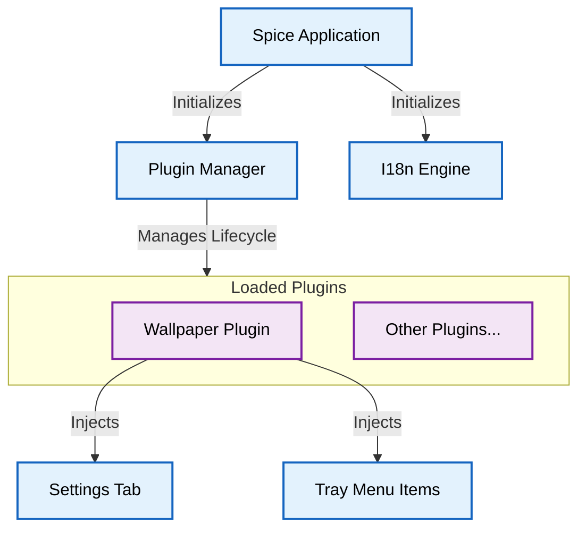
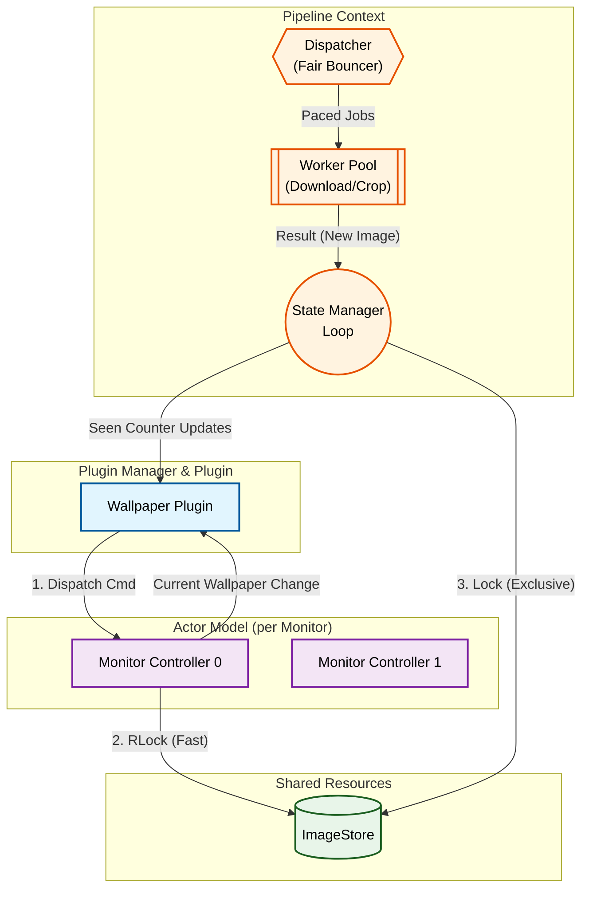
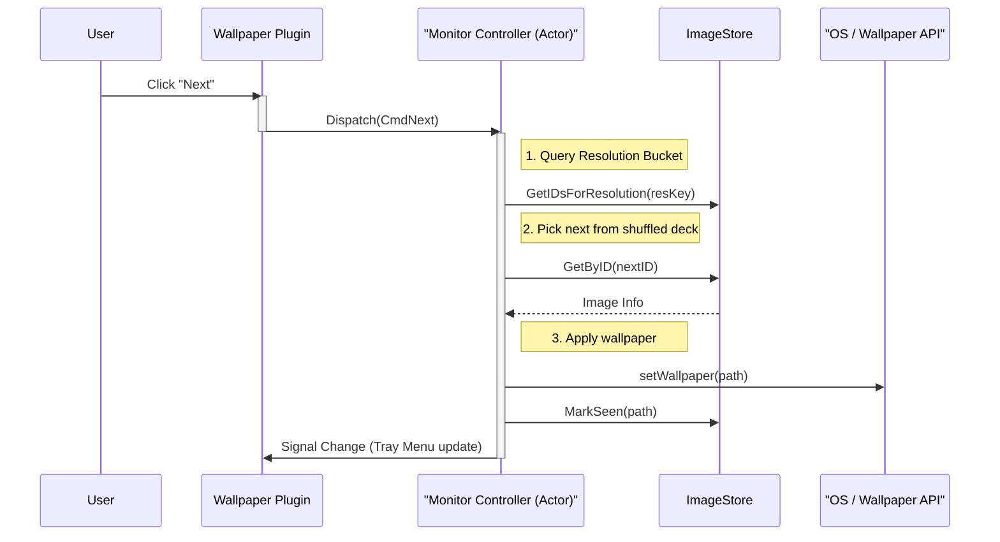
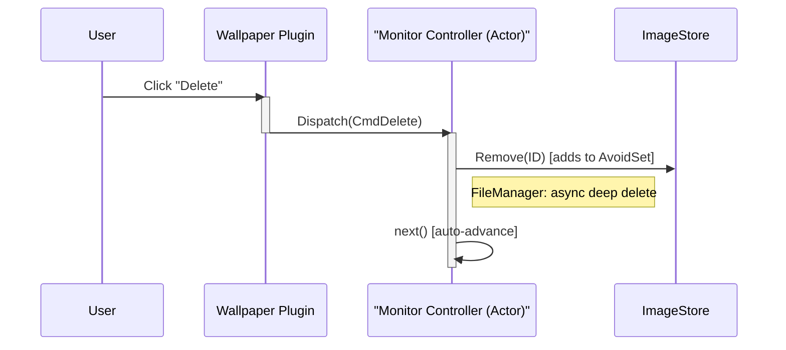
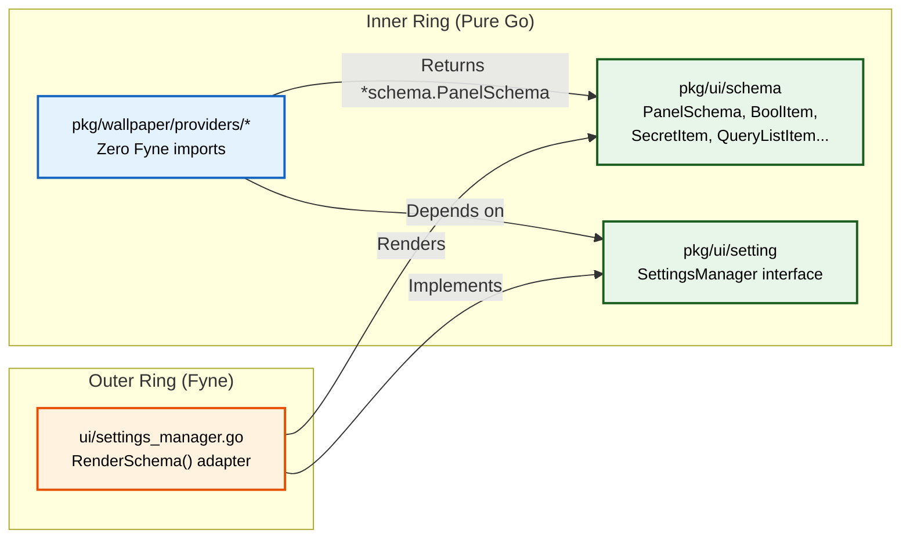
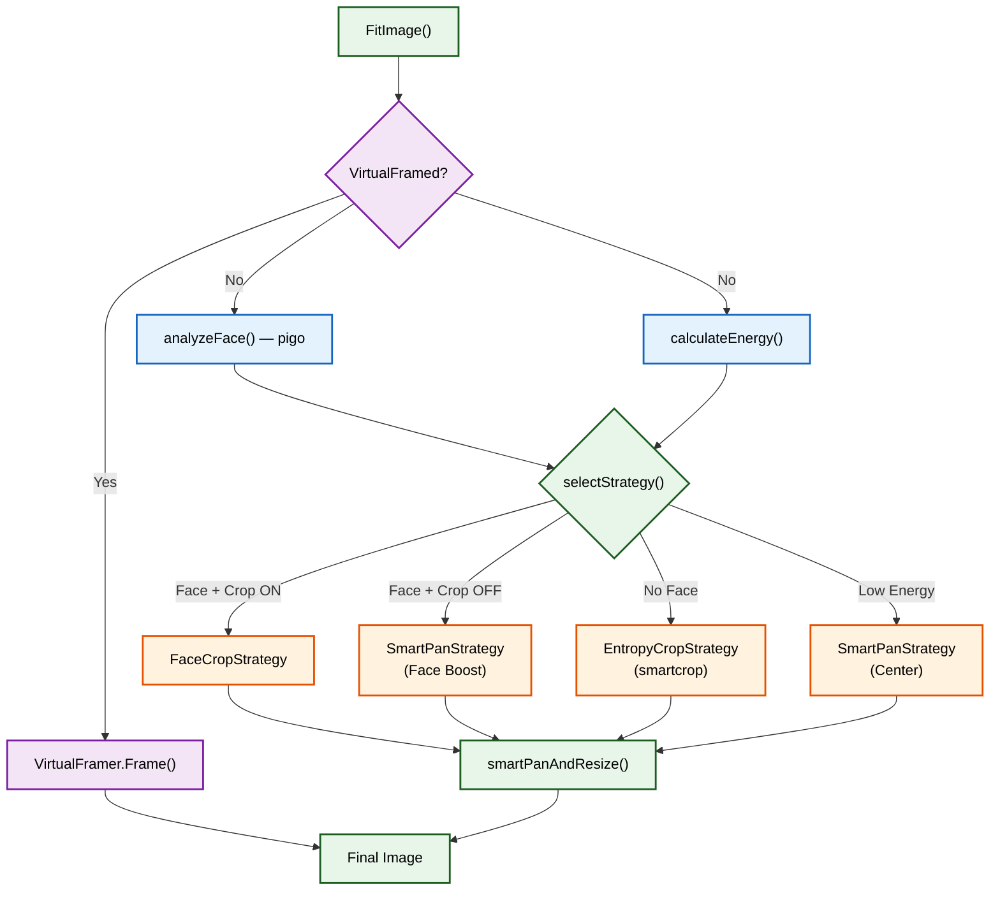
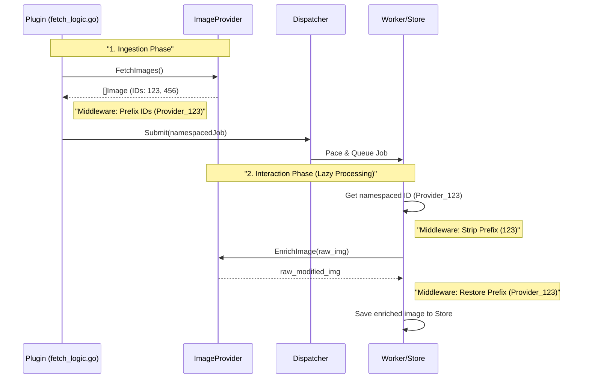

# Spice Architecture Documentation

> **Status**: Current as of v2.6.0
> **Scope**: System design, data flow, and component roles

## 1. Executive Summary

Spice is a cross-platform wallpaper rotation engine built as a modular plugin application. Its core design separates **user interaction** (instant, non-blocking) from **background work** (downloading, processing, persisting) through a hybrid concurrency architecture.

Key design principles:
- **Actor Model**: Each monitor is an independent actor with its own state, shuffle deck, and command loop
- **Pipeline Serialization**: Image ingestion from workers flows through a single goroutine, eliminating lock contention on the hot path
- **Hexagonal Architecture**: All providers are framework-agnostic — they declare UI via pure Go structs, not Fyne widgets
- **Resolution Buckets**: Images are indexed by resolution, enabling O(1) per-monitor image selection
- **I18n Localization**: Decoupled translation system delivering native UI strings across 12 languages via embedded JSON.

## 2. System Architecture (Plugin System)

Spice is built as a modular application where core functionality is delivered via plugins.

```mermaid
graph TD
    classDef core fill:#e3f2fd,stroke:#1565c0,stroke-width:2px,color:#000,font-size:16px;
    classDef plug fill:#f3e5f5,stroke:#7b1fa2,stroke-width:2px,color:#000,font-size:16px;

    App[Spice Application]:::core
    PM[Plugin Manager]:::core
    I18n[I18n Engine]:::core
    
    subgraph Plugins ["Loaded Plugins"]
        WP[Wallpaper Plugin]:::plug
        Other[Other Plugins...]:::plug
    end

    App -->|Initializes| PM
    App -->|Initializes| I18n
    PM -->|Manages Lifecycle| Plugins
    
    WP -->|Injects| SettingsUI[Settings Tab]:::core
    WP -->|Injects| TrayUI[Tray Menu Items]:::core
```

## 3. Data Flow: Image Lifecycle

An image moves through the system in four phases:

```mermaid
graph LR
    classDef fetch fill:#e3f2fd,stroke:#1565c0,stroke-width:2px,color:#000;
    classDef pipe fill:#fff3e0,stroke:#e65100,stroke-width:2px,color:#000;
    classDef store fill:#e8f5e9,stroke:#1b5e20,stroke-width:2px,color:#000;
    classDef display fill:#f3e5f5,stroke:#7b1fa2,stroke-width:2px,color:#000;

    A["1. Fetch<br/>(Provider API)"]:::fetch
    B["2. Process<br/>(SmartFit / Virtual Framer)"]:::pipe
    C["3. Store<br/>(ImageStore)"]:::store
    D["4. Display<br/>(Monitor Actor)"]:::display

    A -->|"Raw URLs"| B
    B -->|"Processed Image / Museum Frame"| C
    C -->|"Resolution Bucket Query"| D
```

1. **Fetch**: `FetchNewImages` queries active providers, namespaces image IDs, and submits jobs to the Pipeline
2. **Process**: Worker pool downloads, decodes, and smart-fits images to each monitor's resolution, producing derivatives
3. **Store**: `ImageStore` indexes images by ID and resolution bucket, persists to disk via debounced JSON writes
4. **Display**: Each `MonitorController` actor queries the store for images matching its resolution, shuffles, and applies wallpapers via OS APIs

## 4. Component Architecture

```mermaid
graph TD
    classDef ui fill:#e1f5fe,stroke:#01579b,stroke-width:2px,color:#000,font-size:16px;
    classDef actor fill:#f3e5f5,stroke:#7b1fa2,stroke-width:2px,color:#000,font-size:16px;
    classDef pipe fill:#fff3e0,stroke:#e65100,stroke-width:2px,color:#000,font-size:16px;
    classDef store fill:#e8f5e9,stroke:#1b5e20,stroke-width:2px,color:#000,font-size:16px;

    subgraph UI_Orchestration ["Plugin Manager & Plugin"]
        Plugin[Wallpaper Plugin]:::ui
    end

    subgraph Actor_Layer ["Actor Model (per Monitor)"]
        Monitor1[Monitor Controller 0]:::actor
        Monitor2[Monitor Controller 1]:::actor
    end

    subgraph Shared_Resource ["Shared Resources"]
        Store[(ImageStore)]:::store
    end

    subgraph Pipeline_Layer ["Pipeline Context"]
        Dispatcher{{"Dispatcher<br/>(Fair Bouncer)"}}:::pipe
        Workers[["Worker Pool<br/>(Download/Crop)"]]:::pipe
        Manager(("State Manager<br/>Loop")):::pipe
    end

    %% Interaction Flows
    Plugin -- "1. Dispatch Cmd" --> Monitor1
    Monitor1 -- "2. RLock (Fast)" --> Store
    
    Dispatcher -- "Paced Jobs" --> Workers
    Workers -- "Result (New Image)" --> Manager
    Manager -- "3. Lock (Exclusive)" --> Store
    
    %% Feedback
    Manager -- "Seen Counter Updates" --> Plugin
    Monitor1 -- "Current Wallpaper Change" --> Plugin
```

### 4.1 Monitor Controller — Actor Pattern (`monitor_controller.go`)

Each physical monitor is managed by an autonomous **Actor** with its own goroutine and state.

- **State**: Current image, history stack, shuffle permutation (`ShuffleIDs`, `RandomPos`), pause state
- **Command Loop**: A dedicated goroutine that `select`s on `Commands` channel and `Store.GetUpdateChannel()`
- **Resolution Isolation**: Each monitor queries the Store for images matching its specific resolution via Resolution Buckets
- **Starvation Recovery**: When a bucket is empty, the actor sets `WaitingForImages=true` and auto-retries when the Store signals new content

### 4.2 ImageStore (`store.go`)

The thread-safe data repository.

- **Primary Data**: `[]provider.Image` (sequential access) + `idSet` (O(1) existence) + `pathSet` (O(1) MarkSeen by filepath)
- **Resolution Buckets**: `map[string][]string` mapping `"WxH"` → list of compatible image IDs. Enables instant per-monitor image selection
- **Persistence**: Debounced (2s) JSON writes using snapshot-under-RLock
- **Writers**: Pipeline (hot path: `Add`, `MarkSeen`) and Plugin (admin: `Remove`, `Wipe`, `Sync`, `RemoveByQueryID`)
- **FIFO Cache Management (`Sync`)**: The store enforces a global, user-configured cache size limit (e.g., 50 images). The `Sync` method acts as a strict **FIFO (First-In, First-Out)** queue. As the Pipeline downloads new images, they are appended to the `s.images` slice. During the nightly or periodic sync, if `len(s.images) > limit`, the Store slices off the *oldest* excess images from the front of the array and permanently deletes their physical `.jpg` files from disk via an asynchronous background job.
	- **Architectural Rule**: Because the Store manages its own cache via FIFO truncation, **Providers must never randomly shuffle their returned API arrays.** Providers must return deterministic pages so the Store can predictably ingest the newest API items while deleting the oldest. The `MonitorController` manages all actual wallpaper shuffling for display.
- **Master Preservation & Baked Derivatives**: When an image is downloaded, the untouched original is saved as a "Master" file. When processing layers (like `SmartImageProcessor` or `VirtualFramer`) crop or frame the image, the output is saved as a resolution-specific "Derivative" (e.g., `1920x1080.jpg`). 
- **Processing Hash & Cache Invalidation**: The Store tracks a `targetFlags` map (the Processing Hash) consisting of all settings that alter image pixels (e.g., SmartFit, FaceCrop, Framing rules). When `Sync()` is called, if the current flags do not match the flags used when an image was cached, the Store automatically invalidates and deletes the stale derivative file. This forces the Pipeline to dynamically re-generate a fresh derivative from the preserved Master image using the new settings.

### 4.3 Pipeline (`pipeline.go`)

The background processing engine.

- **Dispatcher**: Creates a per-provider `pump` goroutine that enforces API rate limits *before* releasing jobs to the shared worker channel. Prevents Head-of-Line blocking between fast and slow providers
- **Worker Pool**: `runtime.NumCPU()` goroutines (configurable) that download, decode, and smart-fit images
- **State Manager Loop**: Single goroutine consuming `resultChan` and `cmdChan`, serializing writes to the Store. Calls `runtime.Gosched()` after each operation to prevent starving UI readers

### 4.4 Fetch & Pagination System

Image fetching is triggered by monitors and throttled by the plugin:

1. **MonitorController** detects starvation (bucket < 5 images) or cycle exhaustion (> 80% of shuffle list consumed)
2. **`RequestFetch()`** (centralized gatekeeper) — anti-loop protection with cooldowns
3. **`FetchNewImages()`** — iterates active queries, each tracking its own global `page` counter persisted to `query_pages.json`.
4. **Safe Page Wrapping** — when a provider returns 0 results for page > 1, auto-resets to page 1.

#### The Museum Provider Overlapping Stride Architecture

While standard providers (like Wallhaven) respond linearly to the global `page` variable passed by `FetchNewImages`, museum APIs often lack stable, sequential pagination. Furthermore, many museum artifacts are aggressively rejected by the SmartFit pipeline due to extreme aspect ratios. 

To ensure a steady stream of usable images without skipping IDs, museum providers employ a "Workaround Architecture":
- **`idCache`**: A localized list of pre-scraped artifact IDs.
- **`poolCache`**: An on-disk cache representing a large bucket of potentially valid artwork.

Instead of directly querying an API page-by-page, the museum provider reads the global `page` integer provided by `FetchNewImages()` and uses it as an *index multiplier* against its `idCache`. 

**The Overlapping Stride Fix:** Because the SmartFit pipeline acts as a strict gatekeeper, fetching 100 images might only yield 20 accepted wallpapers. If the global `page` simply skipped ahead by the number of *scanned* items, the system would mathematically skip over massive chunks of unscanned IDs. To solve this, museum providers use an **Overlapping Stride**. The index stride strictly matches the `targetCount` (e.g., 20) instead of the scan size (e.g., 300). This guarantees that Page 2 starts exactly where Page 1 *should* have stopped if yield was 100%, re-scanning the gap. Since previously fetched items are stored in the local `poolCache`, re-scanning this overlap is instantaneous and network-free, ensuring zero valid IDs are skipped.

### 4.5 Scheduler & Nightly Maintenance (`scheduler.go`)

A persistent goroutine (`StartNightlyRefresh`) runs unconditionally and handles:
- **Day-change detection**: Triggers maintenance on the first tick after midnight
- **Cache grooming**: `store.Sync()` with active query IDs and processing flags
- **Orphan cleanup**: `FileManager.CleanupOrphans()` removes unknown files
- **Provider sync**: Wallhaven collection sync, museum remote config refresh
- **Conditional image fetch**: Only if `NightlyRefresh` preference is enabled

## 5. Interaction Flows

### 5.1 "Next Wallpaper" Flow

```mermaid
sequenceDiagram
    participant User
    participant Plugin as Wallpaper Plugin
    participant MC as "Monitor Controller (Actor)"
    participant Store as ImageStore
    participant OS as "OS / Wallpaper API"

    User->>Plugin: Click "Next"
    activate Plugin
    Plugin->>MC: Dispatch(CmdNext)
    deactivate Plugin
    
    activate MC
    Note right of MC: 1. Query Resolution Bucket
    MC->>Store: GetIDsForResolution(resKey)
    Note right of MC: 2. Pick next from shuffled deck
    MC->>Store: GetByID(nextID)
    Store-->>MC: Image Info
    
    Note right of MC: 3. Apply wallpaper
    MC->>OS: setWallpaper(path)
    MC->>Store: MarkSeen(path)
    MC->>Plugin: Signal Change (Tray Menu update)
    deactivate MC
```

### 5.2 "Delete Wallpaper" Flow

```mermaid
sequenceDiagram
    participant User
    participant Plugin as Wallpaper Plugin
    participant MC as "Monitor Controller (Actor)"
    participant Store as ImageStore

    User->>Plugin: Click "Delete"
    activate Plugin
    Plugin->>MC: Dispatch(CmdDelete)
    deactivate Plugin
    
    activate MC
    MC->>Store: Remove(ID) [adds to AvoidSet]
    Note right of MC: FileManager: async deep delete
    MC->>MC: next() [auto-advance]
    deactivate MC
```

## 6. Schema-Driven UI — Hexagonal Architecture

Spice uses a **Hexagonal Architecture (Ports & Adapters)** for its settings UI. All providers are **100% Fyne-free** — they declare their UI via pure Go `schema.PanelSchema` structs (the **port**), and the rendering engine translates them into Fyne widgets (the **adapter**).

```mermaid
graph LR
    classDef port fill:#e8f5e9,stroke:#1b5e20,stroke-width:2px,color:#000,font-size:14px;
    classDef adapter fill:#fff3e0,stroke:#e65100,stroke-width:2px,color:#000,font-size:14px;
    classDef domain fill:#e3f2fd,stroke:#1565c0,stroke-width:2px,color:#000,font-size:14px;

    subgraph Inner ["Inner Ring (Pure Go)"]
        Schema["pkg/ui/schema<br/>PanelSchema, BoolItem,<br/>SecretItem, QueryListItem..."]:::port
        SMI["pkg/ui/setting<br/>SettingsManager interface"]:::port
        Providers["pkg/wallpaper/providers/*<br/>Zero Fyne imports"]:::domain
    end

    subgraph Outer ["Outer Ring (Fyne)"]
        Engine["ui/settings_manager.go<br/>RenderSchema() adapter"]:::adapter
    end

    Providers -- "Returns *schema.PanelSchema" --> Schema
    Providers -- "Depends on" --> SMI
    Engine -- "Implements" --> SMI
    Engine -- "Renders" --> Schema
```

- **Schema (Port)**: `pkg/ui/schema/schema.go` defines 13+ pure Go types (`BoolItem`, `TextItem`, `SelectItem`, `SecretItem`, `AsyncButtonItem`, `QueryListItem`, `OAuthPickerItem`, `FolderPickerItem`, etc.)
- **SettingsManager (Port)**: `pkg/ui/setting/setting_manager.go` defines the interface
- **Engine (Adapter)**: `ui/settings_manager.go` implements the full rendering pipeline with a **Registry Pattern** (Baseline seeding → Dirty detection → Atomic commit)

## 7. Resource Management

### 7.1 Deep Cache Cleaning

When a query is deleted, a callback chain fires: `Config.onQueryRemoved` → `store.RemoveByQueryID` → `FileManager.DeepDeleteBatch` (Master + all Derivatives).

### 7.2 Provider Strategies

| Strategy | Examples | Flow |
|:---|:---|:---|
| **API Fetch** | Wallhaven, Pexels, Wikimedia | Query API → Get URLs → Download on demand |
| **Import/Pick** | Google Photos | Launch Picker → Bulk download to local cache → Scan as local files |
| **Local Scan** | Favorites, Local Folders | Scan local directory → Index files directly |

### 7.3 Provider Categorization

Providers are categorized by `provider.ProviderType` for UI placement:
- **TypeOnline**: Remote APIs (Pexels, Wallhaven, Wikimedia, Museums). "Online" tab
- **TypeLocal**: Local filesystem (Favorites, Local Folders). "Local" tab

### 7.4 Smart Fit — Image Processing Pipeline

When SmartFit is enabled, every image passes through a content-aware cropping pipeline before being saved as a monitor-specific derivative:

```mermaid
graph TD
    classDef analysis fill:#e3f2fd,stroke:#1565c0,stroke-width:2px,color:#000;
    classDef strategy fill:#fff3e0,stroke:#e65100,stroke-width:2px,color:#000;
    classDef core fill:#e8f5e9,stroke:#1b5e20,stroke-width:2px,color:#000;
    classDef frame fill:#f3e5f5,stroke:#7b1fa2,stroke-width:2px,color:#000;

    A["FitImage()"]:::core --> VF{"VirtualFramed?"}:::frame
    VF -->|"Yes"| VFF["VirtualFramer.Frame()"]:::frame
    VF -->|"No"| B["analyzeFace() — pigo"]:::analysis
    VF -->|"No"| C["calculateEnergy()"]:::analysis
    B --> D{"selectStrategy()"}:::core
    C --> D
    D -->|"Face + Crop ON"| E["FaceCropStrategy"]:::strategy
    D -->|"Face + Crop OFF"| F["SmartPanStrategy<br/>(Face Boost)"]:::strategy
    D -->|"No Face"| G["EntropyCropStrategy<br/>(smartcrop)"]:::strategy
    D -->|"Low Energy"| H["SmartPanStrategy<br/>(Center)"]:::strategy
    E --> I["smartPanAndResize()"]:::core
    F --> I
    G --> I
    H --> I
    VFF --> Out["Final Image"]:::core
    I --> Out
```

**Key design insight 1 (Virtual Framing)**: The `VirtualFramer` sits completely in front of the `SmartImageProcessor`. If an image has extreme aspect ratios but framing is enabled, the pipeline rescues it using a Sentinel Error (`ErrRequiresVirtualFraming`), skipping the crop logic entirely and rendering a blurred museum matting around the untouched artwork.

**Key design insight 2 (Crop Strategies)**: All cropping strategies converge on `smartPanAndResize()`, which takes a center point and crops the largest possible region matching the target aspect ratio around that point. Face detection and smartcrop are **completely separate paths** — they never interact. This design makes extending the crop logic (e.g., user crop anchors) trivial: any new strategy just provides a center point.

> For the full decision tree, Sentinel Error handling, and tuning parameters, see [Internal Developer Context — Section 8](internal_developer_context.md#8-smart-fit-20--image-processing-pipeline).

## 8. ID Namespacing (Middleware)

To prevent ID collisions across providers, IDs are namespaced at the ingestion boundary:

```mermaid
sequenceDiagram
    participant P as Plugin (fetch_logic.go)
    participant Prov as ImageProvider
    participant Disp as Dispatcher
    participant Pipe as Worker/Store

    Note over P,Prov: "1. Ingestion Phase"
    P->>Prov: FetchImages()
    Prov-->>P: []Image (IDs: 123, 456)
    Note right of P: "Middleware: Prefix IDs (Provider_123)"
    P->>Disp: Submit(namespacedJob)
    Disp->>Pipe: Pace & Queue Job

    Note over Pipe,Prov: "2. Interaction Phase (Lazy Processing)"
    Pipe->>Pipe: Get namespaced ID (Provider_123)
    Note right of Pipe: "Middleware: Strip Prefix (123)"
    Pipe->>Prov: EnrichImage(raw_img)
    Prov-->>Pipe: raw_modified_img
    Note right of Pipe: "Middleware: Restore Prefix (Provider_123)"
    Pipe->>Pipe: Save enriched image to Store
```

The Store and FileManager only see namespaced IDs. Providers remain unaware of namespacing.

## 9. Configuration Management (Migration Chain)

Spice uses a **Chain of Responsibility** pattern to manage evolving configuration schemas:
- **MigrationChain**: A sequence of `MigrationStep` functions (e.g., `UnifyQueriesStep`, `EnsureFavoritesStep`)
- On startup, `loadFromPrefs` executes the chain. If any step modifies the config, a save is triggered automatically

## 10. The Curation Engine & Salon Math Gallery

Spice features a robust **Curation Engine** (`pkg/curation/manager.go`) that manages thousands of hand-picked museum masterpieces without relying on brittle search APIs.

- **The Git-Driven Content System**: Spice treats `raw.githubusercontent.com` as a CDN. The Curation Engine fetches remote JSON updates on a nightly OTA (Over-The-Air) schedule, falling back to local cache or embedded assets if offline. This allows curators to add new artworks instantly without requiring users to update the Spice binary.
- **The Salon Math Gallery** (`pkg/gallery/salon.go`): To present these collections beautifully in the UI (e.g., in `docs/collections.html` or internal previews), Spice uses a custom mathematical packer. The `PackSalon` algorithm takes an array of images of various aspect ratios and uses a deterministic spiral-collision search to pack them tightly into an organic, "Salon-style" wall arrangement (inspired by 19th-century French academies), scaling secondary pieces around a primary centerpiece.

## 11. Key Files

| Component | File Path | Responsibility |
| :--- | :--- | :--- |
| **Interfaces**| `pkg/wallpaper/interfaces.go`| `JobSubmitter` and `StoreInterface` |
| **Store** | `pkg/wallpaper/store.go` | Data repository, resolution buckets |
| **Pipeline** | `pkg/wallpaper/pipeline.go` | Worker pool, Dispatcher, State Manager |
| **Actor** | `pkg/wallpaper/monitor_controller.go`| Per-monitor state & wallpaper logic |
| **Controller**| `pkg/wallpaper/wallpaper.go` | Main plugin orchestrator |
| **Processor** | `pkg/wallpaper/smart_image_processor.go` | Face detection, cropping strategies |
| **Crop Strategies** | `pkg/wallpaper/crop_strategies.go` | FaceCrop, SmartPan, EntropyCrop strategy implementations |
| **Fetch Logic** | `pkg/wallpaper/fetch_logic.go` | Provider queries, pagination, dedup |
| **Dispatcher** | `pkg/wallpaper/dispatcher.go` | Fair queue, per-provider rate limiting |
| **Scheduler** | `pkg/wallpaper/scheduler.go` | Nightly maintenance, refresh cycles |
| **Schema** | `pkg/ui/schema/schema.go` | PORT: Framework-agnostic UI contract |
| **Settings** | `pkg/ui/setting/setting_manager.go` | PORT: SettingsManager interface |
| **Engine** | `ui/settings_manager.go` | ADAPTER: Fyne rendering engine |
