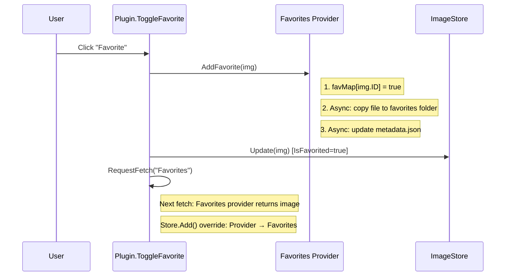
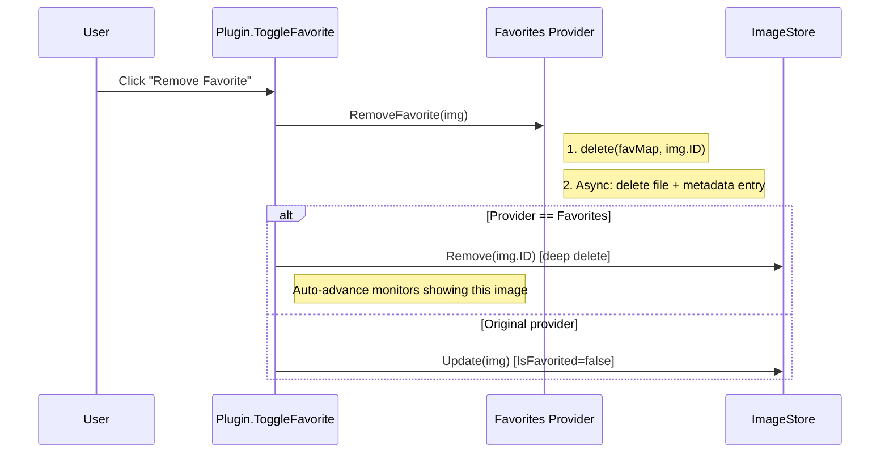

# Concurrency Model & Favorites Lifecycle

> **Status**: Current as of v2.3.0
> **Scope**: Non-UI concurrency patterns, lock hierarchy, and favorites data lifecycle

## 1. Concurrent Actors

| Actor | Goroutines | Lock(s) Held | Lifetime |
| :--- | :--- | :--- | :--- |
| MonitorController | 1 per monitor | `mc.mu` (RWMutex) | `Activate()` → `Deactivate()` |
| Pipeline workers | N (NumCPU) | None (channel-only) | Per fetch cycle |
| Pipeline stateManager | 1 | `store.mu` via Store API | Per fetch cycle |
| Nightly scheduler | 1 | `downloadMutex` | `Activate()` → `Deactivate()` |
| Monitor watcher | 1 | `monMu` (via SyncMonitors) | `Activate()` → context cancel |
| Ticker goroutine | 1 per frequency change | None | Until replaced |
| Fetch goroutines | Up to 5 (semaphore) | `downloadMutex`, `sourcesMutex` | Per fetch cycle |
| Favorites worker | 1 | `favProvider.mu` via favMap | Provider lifetime |

## 2. Lock Hierarchy

Locks must always be acquired in this order to prevent deadlocks:

```
wp.monMu → mc.mu → store.mu → saveMu
wp.downloadMutex (independent — never held with monMu/mc.mu)
favProvider.mu (independent — accessed via Favoriter interface)
```

**Key invariants:**
- `mc.mu.RLock()` is safe from any goroutine **except** the MC's own actor goroutine (which holds `mc.mu.Lock()` in `handleCommand`).
- `store.mu` is always the innermost lock — no code holds `store.mu` while acquiring another lock.
- `downloadMutex` protects `queryPages`, `stopNightlyRefresh`, and fetch state. Never nested with `monMu`.

## 3. Favorites Data Lifecycle

### 3.1 State Locations

| Location | Purpose | Key |
| :--- | :--- | :--- |
| `favorite_images/` folder | Source image files | Filename (e.g., `Wallhaven_21z536.jpg`) |
| `favorite_images/metadata.json` | Attribution & product URL per file | Filename as key |
| `favProvider.favMap` (in-memory) | O(1) "is this ID favorited?" lookup | Image ID (filename sans extension) |
| `image_cache_map.json` (store) | Full image metadata incl. Provider, IsFavorited | Image ID |

### 3.2 Favorite Flow (Add)



**Result**: Single store entry with `Provider=Favorites, IsFavorited=true`.

### 3.3 Unfavorite Flow (Remove)



### 3.4 Startup Reconciliation

On `Activate()`, the system runs a 3-phase cleanup to handle stale state:

```
Phase 1: loadInitialMetadata() [in NewProvider()]
  ├── Read metadata.json → build favMap
  ├── Validate each favMap entry against files on disk (glob)
  └── Orphans found? → delete from favMap + rewrite metadata.json

Phase 2: LoadCache() [in Activate()]
  └── Load image_cache_map.json into store (may contain stale entries)

Phase 3: reconcileFavorites() [in Activate()]
  ├── For each image in store:
  │   ├── If Provider=Favorites && favMap says false:
  │   │   └── store.Remove() — dead entry, source file gone
  │   └── If IsFavorited != favMap[ID]:
  │       └── store.Update() — correct stale flag
  └── Log summary of corrections
```

**`IsFavorited()` source of truth**: The `favMap` is authoritative. There is no short-circuit — all images are validated against the map. This ensures reconciliation can detect and correct any stale state.

### 3.5 Store.Add() Override Rule

When a Favorites-provider image is added with an ID that already exists (from the original provider), the store **replaces** the existing entry:
- `Provider` changes (e.g., `Wallhaven` → `Favorites`)
- `FilePath` changes (points to processed derivative)
- `Seen` state is preserved

This means the store always has **one entry per image ID**, never duplicates.

## 4. Known Concurrency Decisions

### 4.1 Ticker Pointer Comparison (Intentionally Lockless)
The `ChangeWallpaperFrequency` ticker goroutine compares `wp.ticker != currentTicker` without holding `downloadMutex`. This is a best-effort stale-ticker check; the worst case is one extra `SetNextWallpaper` call before the goroutine self-terminates. Acceptable trade-off vs. the complexity of an atomic pointer or done-channel approach.

### 4.2 `Sync.determineSyncAction` avoidSet Read (Practically Safe)
`determineSyncAction` reads `s.avoidSet` in a gap between `mu.RUnlock()` and `mu.Lock()` in `Sync()`. This is technically a data race, but `avoidSet` is only mutated by `Remove()` and `LoadAvoidSet()` — neither runs concurrently with `Sync()` in the current codebase. Documented as an accepted technical debt.
