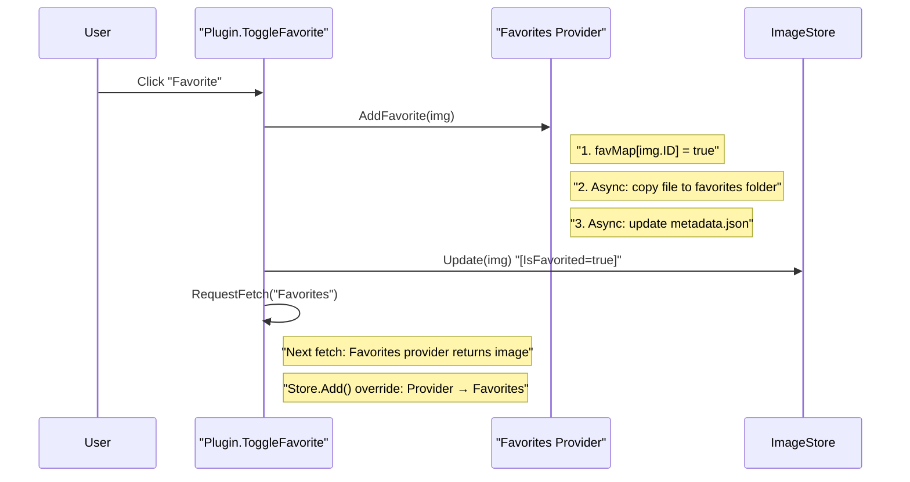
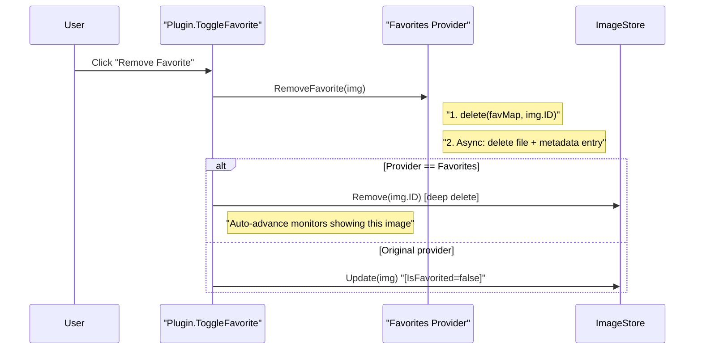

# Spice Internal Developer Context & Architecture Guide

> **Purpose**: This document is the authoritative "Rules & Constraints" guide for the Spice codebase. It contains the concurrency model, lock hierarchy, known gotchas, extension patterns, and implementation details that you **must understand before modifying code**.
>
> For high-level system design and data flow diagrams, see [architecture.md](architecture.md).

## 1. Concurrency Model

Spice uses a **hybrid concurrency model**. The hot path (image ingestion from download workers) is serialized through a single pipeline goroutine (`stateManagerLoop`). Administrative operations (favorites toggling, cache clearing, startup reconciliation, query removal) mutate the store directly under `sync.RWMutex`.

### 1.1 Concurrent Actors

| Actor | Goroutines | Lock(s) Held | Lifetime |
| :--- | :--- | :--- | :--- |
| MonitorController | 1 per monitor | `mc.mu` (RWMutex) | `Activate()` → `Deactivate()` |
| Pipeline workers | `runtime.NumCPU()` (configurable via `MaxConcurrentProcessors`) | None (channel-only) | `Activate()` → `Deactivate()` |
| Pipeline Dispatcher pumps | 1 per active provider (created lazily on first `Submit`) | None (channel-only) | First job → context cancel |
| Pipeline stateManager | 1 | `store.mu` via Store API | `Activate()` → `Deactivate()` |
| Nightly scheduler | 1 | `downloadMutex` | `Activate()` → `Deactivate()` |
| Ticker goroutine | 1 per frequency change | None | Until replaced |
| Fetch goroutines | Up to 5 (semaphore) | `downloadMutex`, `sourcesMutex` | Per fetch cycle |
| Favorites worker | 1 | `favProvider.mu` via favMap | Provider lifetime |
| Enrichment worker | 1 | None (channel-driven) | `Activate()` → `Deactivate()` |

> **Note**: The Pipeline stateManager is the serialized writer for the hot path (`Add`, `MarkSeen`, `Remove`, `Clear`). The Plugin itself also writes to the store directly for admin operations (`Update`, `RemoveByQueryID`, `ResetFavorites`, `Wipe`, `Sync`) under the store's `RWMutex`.

### 1.2 Lock Hierarchy

Locks must always be acquired in this order to prevent deadlocks:

```
wp.monMu → mc.mu → store.mu → saveMu
wp.downloadMutex (independent — never held with monMu/mc.mu)
wp.globalFetchMu (independent — protects global fetch cancellation context)
wp.queryCancelMu (independent — protects per-query context map)
favProvider.mu (independent — accessed via Favoriter interface)
```

**Key invariants:**
- `mc.mu.RLock()` is safe from any goroutine **except** the MC's own actor goroutine (which holds `mc.mu.Lock()` in `handleCommand`).
- `store.mu` is always the innermost lock — no code holds `store.mu` while acquiring another lock.
- `downloadMutex` protects `queryPages`, `stopNightlyRefresh`, and fetch state. Never nested with `monMu`.
- **`monMu` must never be held when calling into Fyne's main thread** (via `fyne.Do`, menu updates, or widget operations). The Fyne main thread may itself need `monMu` to read monitor state, creating a deadlock. `CreateTrayMenuItems` snapshots all monitor state under `monMu` at the top, releases it, then builds menu items lock-free. `updateTrayMenuUI`'s `fyne.Do` callback must not acquire `monMu`.
- **`OpenPreferences` must use `fyne.Do`** to marshal window creation onto Fyne's main thread. This is called from the local API HTTP server (browser extension), which runs on a background goroutine. macOS forbids window creation from background threads.

### 1.6 OpenGL Safety Guard (Windows)

On Windows, Fyne's GLFW driver hard-codes `os.Exit(1)` when OpenGL context creation fails (e.g., after a GPU driver auto-update that leaves OpenGL broken until reboot). Go's `recover()` cannot catch this because it occurs in C code.

**Solution**: `CanCreateWindows()` (`pkg/sysinfo/windows.go`) spawns the app binary as a hidden subprocess with `-probe-gl`. The subprocess attempts to create a minimal Fyne window:
- Exit 0 → OpenGL works → proceed normally
- Exit 1 → OpenGL broken → show native Win32 MessageBox alert, keep background rotation alive

The probe subprocess calls `SetErrorMode(SEM_NOGPFAULTERRORBOX | SEM_FAILCRITICALERRORS)` before Fyne initialization to suppress Windows Error Reporting crash dialogs (`cmd/spice/probe_windows.go`).

On macOS, `CanCreateWindows()` always returns `true` — Metal/OpenGL is always available regardless of connection method.

### 1.3 The Store (`pkg/wallpaper/store.go`)

The source of truth. Thread-safe container with **no iteration logic** (no `currentIndex`).

- **Data Structures**:
    - `[]provider.Image` — sequential access (history, serialization)
    - `idSet map[string]bool` — O(1) existence checks (45ns vs 470ns+ linear scan)
    - `pathSet map[string]int` — O(1) `MarkSeen` by filepath (index into images slice)
    - `resolutionBuckets map[string][]string` — `"WxH"` → list of image IDs. Enables per-monitor image selection without scanning the entire store
    - `avoidSet map[string]bool` — block list (deleted/blocked image IDs)
- **Locking**:
    - `RLock()`: Used by MonitorControllers for instant "Next/Prev" actions
    - `Lock()`: Used by the Pipeline's StateManager (hot path) and the Plugin (admin ops)
- **Persistence**: Debounced via `scheduleSaveLocked()` with configurable duration (default 2s). Uses snapshot-under-RLock for non-blocking writes
- **`QueryActiveFunc`**: Callback injected by the Plugin. Allows the Store to reject images from queries that were disabled mid-download
- **`WaitForImages`**: Event-driven notification channel. MonitorControllers and the initial pulse use this to block until new content arrives, replacing polling

### 1.4 The Pipeline (`pkg/wallpaper/pipeline.go`)

The workhorse for image processing.

- **Dispatcher (`dispatcher.go`)**: Creates a **per-provider pump goroutine** on first job submission. Each pump applies API rate limits (`rate.Limiter`) and process rate limits *before* releasing jobs to the shared worker channel. This prevents Head-of-Line blocking — a slow provider (Wikimedia with 429 limits) never delays a fast provider (Pexels)
- **Worker Pool**: `runtime.NumCPU()` goroutines (overridable via `MaxConcurrentProcessors` preference). Workers consume from unbuffered `jobChan` and produce to buffered `resultChan`
- **State Manager Loop**: Single goroutine. `select`s on:
    1. `resultChan`: New images from workers → calls `store.Add()`
    2. `cmdChan`: Commands from UI (`CmdMarkSeen`, `CmdRemove`, `CmdClear`)
    3. `ctx.Done()`: Shutdown
- **Yielding**: Calls `runtime.Gosched()` after every operation to prevent starving readers

### 1.5 The MonitorController (`monitor_controller.go`)

Each physical monitor is an **Actor** with its own goroutine, state, and command channel.

- **Command Loop**: `select`s on `Commands` channel and `Store.GetUpdateChannel()` (broadcast pattern for new content)
- **`next()` Flow**:
    1. Query resolution bucket: `store.GetIDsForResolution("1920x1080")`
    2. Check starvation: bucket < `BucketStarvationThreshold` (5) → trigger fetch
    3. Check cycle progress: `RandomPos > 80% of ShuffleIDs` → trigger fetch
    4. Rebuild shuffle if bucket size changed
    5. Pick next from shuffled deck, skipping blocked/missing images
    6. Apply wallpaper via OS API, call `MarkSeen()` directly on store
- **Starvation Recovery**: When bucket is empty, sets `WaitingForImages=true`. The `Store.GetUpdateChannel()` listener automatically retries `next()` when new content arrives

## 2. Pagination & Fetch Trigger System

The old centralized `applyWallpaper` checking `seenCount/totalCount` is **gone**. The current system has four layers:

### Layer 1: MonitorController → Per-Monitor Starvation Detection

Each monitor independently decides when to request more images:

```
On every next():
  1. Get bucket = store.GetIDsForResolution("1920x1080")
  2. If bucket.size < 5 (BucketStarvationThreshold) → request fetch
  3. Else if shufflePosition > 80% of shuffleList → request fetch
  4. Callback: mc.OnFetchRequest() → wp.RequestFetch()
```

This is **per-monitor, per-resolution**. A 4K monitor can be starving while a 1080p monitor has plenty.

### Layer 2: Plugin → Anti-Loop Protection (`RequestFetch`)

`RequestFetch()` is the centralized gatekeeper. It does NOT decide *when* to fetch — it prevents storms:

- **Debounce**: Skip if `isDownloading` or `fetchingInProgress` (except Favorites — local scan is cheap)
- **Dry Source Detection**: If `totalCount` hasn't grown since last trigger AND `seenCount` has → 60s cooldown
- **Rapid Retry**: If `seenCount` hasn't changed → 15s cooldown
- **Targeted fetch**: Optional `providerID` parameter restricts to one source

### Layer 3: Fetch Logic → Per-Query Pagination (`FetchNewImages`)

Each query tracks its own page counter, persisted to `query_pages.json`:

- Page counter stored as `SafeCounter` per query ID
- `FetchImages(ctx, url, page)` called for each active query
- If 0 results AND page > 1 → **Safe Page Wrap** back to page 1
- If results found → increment page, persist to `query_pages.json`
- Namespacing middleware applied at ingestion: `img.ID = provider.ID() + "_" + img.ID`
- Dedup: existing images are only re-submitted if missing derivatives for current monitors ("Backlog Healing")

### Layer 4: Automatic Rotation (Ticker)

`ChangeWallpaperFrequency` creates a `time.Ticker` → `SetNextWallpaper(-1, false)` → dispatches `CmdNextAuto` to all monitors. Secondary monitors can be staggered (10-30% random delay of interval).

## 3. Persistent Architectural Constraints (Golden Rules)

⚠️ **Never remove or "refactor away" these mechanisms. They solve recurring production bugs.**

1.  **Safe Page Wrapping (`fetch_logic.go`)**:
    *   **Rule**: When `FetchImages` returns 0 results for a `page > 1`, ALWAYS reset the query to `Page 1`.
    *   **Rationale**: Most providers have finite pages. Without wrapping, the wallpaper flow dies permanently once the last page is reached.
    *   **Restriction**: Do NOT wrap if `err != nil`. This distinguishes "EndOfResults" from "NetworkError".

2.  **Resolution Probing & Persistence (`downloader.go`)**:
    *   **Rule**: Once an image is opened (or its header decoded), the discovered `Width` and `Height` MUST be saved back to the `Store`.
    *   **Rationale**: Fixes the "Ghost Dimension" (0×0) bug where lack of persistence forces expensive full-file decodes on every refresh.

3.  **Deadlock-Free Deduplication (`fetch_logic.go`)**:
    *   **Rule**: The fetcher MUST NOT skip an image just because it exists in the store. It must also check if the image is missing a derivative for the *current* monitors.
    *   **Rationale**: Essential for "Backlog Healing." If a user adds a new monitor, the system must be able to pull existing cached originals back into the processing pipeline.

## 4. Known Concurrency Decisions

### 4.1 Ticker Pointer Comparison (Intentionally Lockless)
The `ChangeWallpaperFrequency` ticker goroutine compares `wp.ticker != currentTicker` without holding `downloadMutex`. This is a best-effort stale-ticker check; the worst case is one extra rotation call before the goroutine self-terminates. Acceptable trade-off vs. the complexity of an atomic pointer or done-channel approach.

### 4.2 `Sync.determineSyncAction` avoidSet Read (Practically Safe)
`determineSyncAction` reads `s.avoidSet` between snapshot and exclusive lock in `Sync()`. This is technically a data race, but `avoidSet` is only mutated by `Remove()` and `LoadAvoidSet()` — neither runs concurrently with `Sync()` in the current codebase. Documented as accepted technical debt.

### 4.3 Fair Dispatcher Architecture
The Dispatcher creates **one pump goroutine per active provider** (not a single global goroutine). Each pump applies provider-specific `rate.Limiter` delays *before* releasing jobs to the shared `jobChan`. This transforms unbounded concurrent network spikes into orderly bursts, ensuring fast providers are processed instantly while slow/strict providers are perfectly paced.

### 4.4 Provider Bulkheads & Circuit Breakers (Concurrency Isolation)
For extremely rigid providers (like Wikimedia's stringent 429 policies), Spice employs **Bulkheads** (1-slot semaphores) at the API polling level, and **Global Circuit Breakers** at the transport layer. This isolates strict domains so their failures, pacing, and HTTP 429 cooldown limits never stall the generic orchestrator or other providers.

## 5. Favorites Data Lifecycle

### 5.1 State Locations

| Location | Purpose | Key |
| :--- | :--- | :--- |
| `favorite_images/` folder | Source image files | Filename (e.g., `Wallhaven_21z536.jpg`) |
| `favorite_images/metadata.json` | Attribution & product URL per file | Filename as key |
| `favProvider.favMap` (in-memory) | O(1) "is this ID favorited?" lookup | Image ID (filename sans extension) |
| `image_cache_map.json` (store) | Full image metadata incl. Provider, IsFavorited | Image ID |

### 5.2 Favorite Flow (Add)



**Result**: Single store entry with `Provider=Favorites, IsFavorited=true`.

### 5.3 Unfavorite Flow (Remove)



### 5.4 Startup Reconciliation

On `Activate()`, a 3-phase cleanup handles stale state:

```
Phase 1: loadInitialMetadata() [in NewProvider()]
  ├── Read metadata.json → build favMap
  ├── Validate each favMap entry against files on disk (glob)
  └── Orphans found? → delete from favMap + rewrite metadata.json

Phase 2: LoadCache() [in Activate()]
  └── Load image_cache_map.json into store (may contain stale entries)

Phase 3: reconcileFavorites() [in Activate()]
  ├── For each image in store:
  │   ├── If Provider=Favorites && favMap says false:
  │   │   └── store.Remove() — dead entry, source file gone
  │   └── If IsFavorited != favMap[ID]:
  │       └── store.Update() — correct stale flag
  └── Log summary of corrections
```

**`IsFavorited()` source of truth**: The `favMap` is authoritative. All images are validated against it.

### 5.5 Store.Add() Override Rule

When a Favorites-provider image is added with an ID that already exists (from the original provider), the store **replaces** the existing entry. `Provider` changes, `FilePath` changes, `Seen` state is preserved. The store always has **one entry per image ID**, never duplicates.

## 6. Schema-Driven UI Architecture (Hexagonal / Ports & Adapters)

Providers never import or create Fyne widgets directly. They declare their UI needs using pure Go structs, and a central rendering engine translates those structs into framework widgets.

### 6.1 The Boundary

```
┌─────────────────────────────────────────────────────────────────┐
│  INNER RING (Pure Go — zero framework imports)                  │
│                                                                 │
│  pkg/provider/provider.go     → Domain interfaces               │
│  pkg/ui/schema/schema.go      → PORT: UI contract (ItemSchema)  │
│  pkg/ui/schema/museum.go      → Schema helpers (museum template)│
│  pkg/ui/setting/setting_mgr   → PORT: SettingsManager interface │
│  pkg/wallpaper/providers/*    → Domain logic (100% Fyne-free)   │
└─────────────────────────────────────────────────────────────────┘
                              ▲
                              │  Returns *schema.PanelSchema
                              │
┌─────────────────────────────────────────────────────────────────┐
│  OUTER RING (Framework-coupled — Fyne)                          │
│                                                                 │
│  ui/settings_manager.go       → ADAPTER: RenderSchema()         │
│  ui/ui.go                     → Application shell & tray        │
└─────────────────────────────────────────────────────────────────┘
```

### 6.2 Schema Types (`pkg/ui/schema/schema.go`)

| Schema Type | Purpose |
|:---|:---|
| `BoolItem` | Checkbox/toggle with `ApplyFunc`, `EnabledIf`, `VisibleIf` |
| `TextItem` | Text entry with validation, debounce, `PostValidateCheck`, password masking |
| `SelectItem` | Dropdown with index-based value tracking |
| `SecretItem` | API key/credential with `OnVerify` and `OnClear` (Transactional pattern) |
| `ButtonItem` | Simple action button |
| `AsyncButtonItem` | Button with loading state and background task |
| `ConfirmButtonItem` | Button with confirmation dialog |
| `HyperlinkItem` | Clickable URL |
| `LabelItem` | Static text or description |
| `QueryListItem` | Full query management list (toggle, delete, display) |
| `OAuthPickerItem` | OAuth + Picker workflow (Google Photos) |
| `FolderPickerItem` | Native directory selector (Local Folders) |
| `HorizontalRowItem` | Groups items side-by-side |

### 6.3 The Registry Pattern (Deferred Save)

Settings UI uses a **Deferred Save / Git-like Commit** model:

1. **Baseline Seeding**: `RenderSchema` creates widgets and mirrors initial values into the registry
2. **Live Comparison**: `OnChanged` handlers compare widget state against the registry baseline
3. **Reactive State**: `EnabledIf` / `VisibleIf` for dynamic control, `SetValue()` for cross-widget updates
4. **Atomic Commit**: "Apply" executes all queued `ApplyFunc` callbacks and promotes Live → Baseline

### 6.4 The Transactional UI Pattern (Credentials)

For `schema.SecretItem`, Spice bypasses the deferred model:
- Verification only occurs when "Verify & Connect" is explicitly clicked
- On success: key is saved immediately, baseline is seeded, field locks via `EnabledIf`
- All verification transactions MUST include a timeout (standard: 10s) via `context.WithTimeout`

### 6.5 The Generic Action Pattern (Query Lists)

`schema.QueryListItem` uses an **Explicit Action Contract**:
- `DeleteLabel`: Provider can rename the button (e.g., "Clear")
- `ForceActionEnabled`: Overrides `Managed` check (for Favorites)
- `DeleteConfirmMessage`: Provider-specific warnings
- `GetDisplayText` / `GetDisplayURL`: Pure functions for custom rendering

### 6.6 UI Services

Providers use `SettingsManager` interface methods for dialogs — **never** direct Fyne `dialog.*` imports:
- `sm.ShowError(err)`, `sm.ShowConfirm(title, message, callback)`
- `sm.ShowAddQueryDialog(cfg, url, desc, onAdded)`, `sm.OpenURL(urlString)`

## 7. Provider Implementations

Key logic patterns for the major providers in `pkg/wallpaper/providers/`. **All providers are 100% Fyne-free**.

### 7.1 Wallhaven (`wallhaven.go`)
- **Regex Router**: Rigorous URL parsing (`UserFavoritesRegex`, `SearchRegex`)
- **API Key Hygiene**: `ParseURL` strips `apikey` params. Keys stored in OS keychain, masked via `schema.SecretItem`

### 7.2 The Met Museum (`metmuseum.go`)
- **Schema Template**: `schema.CreateMuseumSettingsPanel()` for standardized museum layout
- **Parallel Fetching**: `errgroup` with concurrency limit (5)
- **Aspect Ratio Filter**: Rejects > 3.0 or < 0.33

### 7.3 Favorites (`favorites.go`)
- **Worker Pattern**: File IO via `jobChan` + `runWorker` loop
- **FIFO Garbage Collection**: Enforces `MaxFavoritesLimit`, deletes oldest by `ModTime`
- **Metadata Sidecar**: `metadata.json` for Attribution and Product URL

### 7.4 Local Folders (`localfolder.go`)
- **Cross-Platform Picker**: `schema.FolderPickerItem` (Windows uses `cfd` shell picker)
- **Recursive Scanning**: `filepath.WalkDir` with early-exit optimization

## 8. Smart Fit 2.0 — Image Processing Pipeline

The imaging engine (`pkg/wallpaper/smart_image_processor.go`, `pkg/wallpaper/crop_strategies.go`) is the core of Spice's content-aware cropping. It uses the **Strategy Pattern** to select the best cropping approach for each image.

### 8.1 Pipeline Overview

```
FitImage(img, targetW, targetH)
  │
  ├── SmartFit Off?        → return original
  ├── CheckCompatibility() → reject incompatible aspect ratios
  ├── Exact match/aspect?  → simple resize
  │
  ├── 1. analyzeFace()     → pigo face detection
  ├── 2. calculateEnergy() → luminance std-dev (entropy proxy)
  ├── 3. checkQualityGate()→ Quality mode rejection/rescue
  ├── 4. selectStrategy()  → pick crop strategy
  └── 5. strategy.Apply()  → execute crop + resize
```

### 8.2 The Entry Point: `FitImage()`

Every image passes through `FitImage()` before being saved as a derivative. The function runs a fixed sequence:

1. **Compatibility Check**: `CheckCompatibility()` applies aspect ratio thresholds based on SmartFit mode (Quality vs Flexibility). Quality mode rejects large mismatches; Flexibility mode uses a dynamic threshold scaled by image surplus resolution
2. **Fast Paths**: Exact dimension matches or matching aspect ratios skip the full pipeline and go straight to resize
3. **Analysis Phase**: Face detection (pigo) and energy calculation run unconditionally (both are needed for strategy selection and gate checks)
4. **Quality Gate**: In Quality mode, images outside the aspect threshold are rejected — unless a strong face is detected ("Face Rescue"), which overrides the rejection
5. **Strategy Selection**: `selectStrategy()` picks the best crop approach (see below)
6. **Execution**: The chosen strategy's `Apply()` is called

### 8.3 Strategy Selection: `selectStrategy()`

The decision tree, in priority order:

```go
1. Flexibility Mode + No Face + Low Energy → SmartPanStrategy (center)
   // Flat images (sky, solid backgrounds) — entropy crop would pick noise
   
2. Face Found + FaceCrop Enabled → FaceCropStrategy
   // Tight crop centered on the face bounding box
   
3. Face Found + FaceCrop Disabled → SmartPanStrategy (face center)
   // "Face Boost" — max crop panned toward the face
   
4. Default (no face) → EntropyCropStrategy
   // Smartcrop analysis → extract center → SmartPan
```

> **Critical**: Face detection and smartcrop are **completely separate paths**. When a face is found, smartcrop is never called. The face center becomes the pan target directly.

### 8.4 The Three Crop Strategies

All strategies are defined in `crop_strategies.go` and implement the `CropStrategy` interface.

#### FaceCropStrategy ("Face Crop")
- **When**: Face detected AND `FaceCropEnabled=true`
- **Logic**: `cropAroundFace()` builds a crop rectangle tightly centered on the face bounding box, sized to match the target aspect ratio. The crop dimensions are the maximum that fits the target aspect, centered on the face center point
- **Result**: Aggressive zoom on the face — the face IS the composition. Surrounding scene may be heavily cropped
- **Use case**: Portrait-style images where the subject's face is the primary interest

#### SmartPanStrategy ("Face Boost" / Center Fallback)
- **When**: Face detected but `FaceCropEnabled=false`, OR low-energy fallback
- **Logic**: `smartPanAndResize()` calculates the **largest possible crop** matching the target aspect ratio, then **pans** it so the given center point (face center or image center) is included. The crop is clamped to image bounds
- **Result**: Preserves maximum scene context while ensuring the focal point is in frame
- **Use case**: Landscape images with a person — keep the scenery, just make sure the face isn't cut off

#### EntropyCropStrategy (Smartcrop Fallback)
- **When**: No face detected (the default fallback)
- **Logic**:
  1. Calls `muesli/smartcrop.FindBestCrop()` which generates thousands of candidate crop rectangles and scores each on edge detail (Green channel), skin tone (Red channel), and saturation (Blue channel). The scoring favors center-biased compositions with rule-of-thirds bonuses
  2. Extracts the **center point** of the winning crop
  3. Passes that center to `smartPanAndResize()` (same function as Face Boost)
- **Feet Guard**: If smartcrop selects a crop starting very far down the image (suggesting the algorithm locked onto feet/ground texture), the strategy falls back to a center crop. The threshold relaxes for high-energy images and stays strict for low-energy (sky/ground) images
- **Result**: Content-aware crop based on visual interest regions

### 8.5 The Convergence Point: `smartPanAndResize()`

All three strategies ultimately converge on this function. It takes a center point and:

1. Calculates the **largest possible crop** matching the target aspect ratio (constrained by whichever image dimension is the limiting factor)
2. Centers the crop rectangle on the given point
3. Clamps to image bounds (slides the rectangle if it extends past edges)
4. Sub-images the crop region
5. Resizes to the exact target dimensions using Lanczos resampling

This is why the crop anchor feature can integrate cleanly — it just needs to provide a center point to this existing function.

### 8.6 Face Detection: `findBestFace()` (pigo)

Uses the [pigo](https://github.com/esimov/pigo) face detection library (Pixel Intensity Comparison-based Object detection):

1. Converts image to grayscale
2. Runs cascade classifier with configurable min/max face size
3. Clusters overlapping detections using IoU threshold
4. Filters results:
   - **Confidence floor**: Rejects low-Q detections (noise/shadows)
   - **Edge safety**: Discards low-confidence detections in the bottom 30% of the frame (real faces rarely appear at the literal bottom edge of wallpapers)
   - **Confidence-weighted selection**: Picks the face with highest `Q × Scale` score (prevents low-confidence large blobs from winning over high-confidence mid-sized faces)
5. Expands the winning bounding box by 1.5× (pigo detects the "core" eyes/nose/mouth area — expansion covers forehead and chin)

### 8.7 Energy Calculation

`calculateImageEnergy()` computes the standard deviation of luminance across a downsampled thumbnail:

- **Purpose**: Proxy for visual complexity ("entropy")
- **Low energy** (< `MinEnergyThreshold`): Flat images (solid colors, gradients, clear skies). Entropy crop would pick noise, so the pipeline falls back to center crop
- **High energy**: Complex textures, detailed scenes. Entropy crop can find meaningful focal points
- **Also used by**: Feet Guard threshold relaxation — high-energy images are allowed more aggressive bottom-biased crops

### 8.8 Compatibility Gates

Before any cropping, `CheckCompatibility()` rejects images that are too far from the target aspect ratio:

**Quality Mode** (`SmartFitNormal`):
- Orientation mismatch with diff > 0.5 → reject
- Aspect diff > 1.5 → reject
- Exception: Strong face (Q > `FaceRescueQThreshold`) "rescues" the image despite aspect mismatch

**Flexibility Mode** (`SmartFitAggressive`):
- Dynamic threshold: `base × surplus × AggressiveMultiplier` (capped at 1.5)
- Orientation mismatch: Threshold capped at 0.8 (allows 4:3→Portrait but blocks 16:9→Portrait)
- Higher resolution images get more leeway (surplus factor)

### 8.9 Externalized Tuning (`pkg/wallpaper/tuning.go`)

All magic numbers live in `TuningConfig`: `AggressiveMultiplier`, `FaceRescueQThreshold`, `FeetGuardRatio`, `FeetGuardSlackThreshold`, `FaceDetectConfidence`, `FaceBottomEdgeThreshold`, `MinEnergyThreshold`, etc. Structured for future remote hot-swap via the museum-style config update pattern.

## 9. Extension Guide

### 9.1 Adding a New Provider
1. Create package: `pkg/wallpaper/providers/myprovider`
2. Implement `provider.ImageProvider` — return `*schema.PanelSchema`, not Fyne widgets
3. Register via `wallpaper.RegisterProvider()`
4. Run `go generate ./...` (or `make gen`) — auto-discovery via `gen_providers`
5. To disable: add a `.disabled` file to the provider directory

### 9.2 UI Standardization
- Use `schema.AddQueryConfig` for add-query modals
- For museums: `schema.CreateMuseumSettingsPanel()`

## 10. The "Live Update" Architecture (Museums)

### 10.1 The Fallback Chain
`InitRemoteCollection()` logic:
1. **Remote Fetch**: HTTP GET `raw.githubusercontent.com/.../met.json` (Timeout: 3s)
2. **Local Cache**: If remote fails, load `~/.config/spice/cache/met/met_cache.json`
3. **Embed**: If cache missing, load `//go:embed met.json`
4. **Hardcoded**: If all fails, load `SpiceMelangeIDs` (Go `const` slice)

## 11. Development Environment & Secrets

### 11.1 The `.spice_secrets` File
Create in project root (git-ignored). Format: `KEY=VALUE`.

### 11.2 The `load_secrets` Helper
```powershell
. .\load_secrets.ps1  # PowerShell
source ./load_secrets.sh  # Bash
go run cmd/spice/main.go
```

The `Makefile` handles this automatically via `cmd/util/load_secrets/main.go`.

## 12. Internationalization & Localization (i18n)

### 12.1 Translation Architecture
- `i18n.T("key")`: Standard retrieval
- `i18n.Tf("key", map)`: Templated (Go `text/template`)
- `i18n.N("key", count)`: Pluralized
- Translations embedded via `//go:embed` from `pkg/i18n/translations/*.json`

### 12.2 The `gen-i18n` Tool
- **Generate**: `make gen-i18n` — scans source for i18n calls, updates all language files
- **Check**: `make check-i18n` — CI gate for stale/missing/untranslated keys

### 12.3 Allowlists
- `allowIdenticalToEnglish`: Proper nouns, loanwords, brand names
- `dynamicI18nKeys`: Keys used via variables, invisible to static scanner

### 12.4 Adding New Strings
```bash
i18n.T("My New String")     # 1. Write code
make gen-i18n                # 2. Generate (auto-adds to en.json)
make check-i18n              # 3. CI verifies sync
```

### 12.5 Adding a New Language
1. Create `pkg/i18n/translations/[code].json` with `"_meta_name"` key
2. Run `make gen-i18n` — auto-generates language registry

### 12.6 Tray Menu Constraints (Critical)
- **Brevity**: Windows calculates tray width from longest item
- **Mnemonic Safety**: Use `+` not `&` as separator
- **Sanitization**: Dynamic strings must pass through `SanitizeMenuString`
- **Rune-Aware Truncation**: Always `[]rune` before slicing

## 13. UI Configuration & State Management

### 13.1 Automatic Config Saves
Spice implements an automatic state management pattern via `SettingsManager` (`pkg/ui/setting/manager.go`) to remove boilerplate dirty tracking and manual "Save" buttons.
- Any change to a schema-driven UI component (e.g., `schema.TextItem`, `schema.BoolItem`) automatically triggers its configured `ApplyFunc` and marks the config state as dirty.
- The `SettingsManager` automatically intercepts these changes and invokes the `OnSettingsSaved` callback to persist the configuration to disk (e.g., `cfg.save()`).

### 13.2 Schema Modifiers
When building settings panels, use schema decorators rather than raw Fyne widgets:
- `IsNumeric: true` (on `schema.TextItem`): Enforces numeric-only input on the `fyne.Entry` widget, ensuring integer parsing doesn't panic in the `ApplyFunc`.
