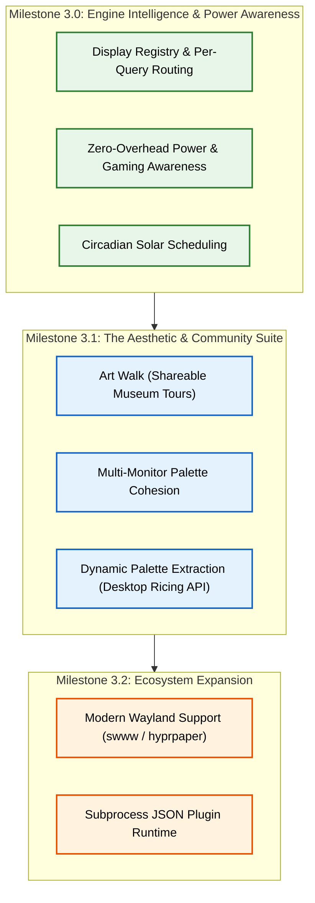
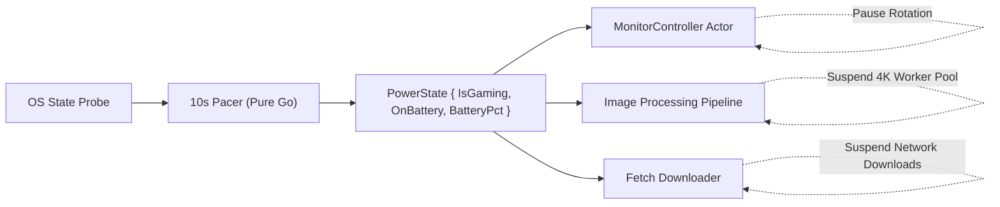
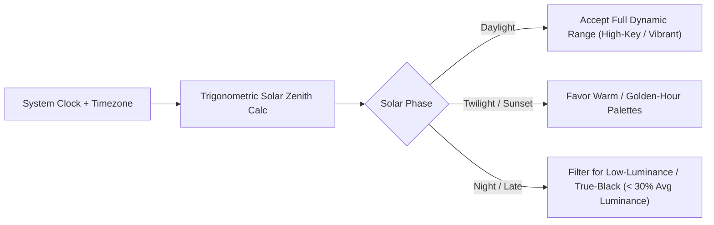

# Spice v3.0 Comprehensive Architectural Plan & Roadmap

> **Status**: Approved Roadmap / Pre-Implementation Design  
> **Target Release Line**: v3.0.0 – v3.2.0  
> **Core Architecture**: Pure-Go, Zero-Lag, Decoupled Hexagonal Engine

---

## 1. Executive Summary & Vision

Spice v3.0 elevates the application from a wallpaper rotation utility to a **desktop environmental engine**. The core architectural themes are:

1. **System & Environmental Awareness**: Adapting rotation, decoding, and downloads to hardware power states (gaming, battery, presentations) and circadian solar cycles with zero runtime overhead.
2. **Multi-Display Intelligence**: Hardware display fingerprinting, per-screen query routing, and cross-monitor aesthetic palette harmonization.
3. **Curation & Community (Art Walk)**: Shareable, curated museum walk-throughs with personal curator commentary via an open, App Store-safe YAML specification.
4. **Ecosystem & Ricing Integration**: Dynamic palette extraction (Material You / pywal) exposed via REST API and modern Wayland Linux desktop orchestration.

---

## 2. Milestone Overview



---

# Milestone 3.0: Engine Intelligence & Power Awareness

---

## Feature 1: Zero-Overhead Process & Power Awareness

### Problem Statement
Desktop wallpaper rotation must never compete with foreground tasks. Performing 4K image decoding or network downloads during full-screen gaming (e.g., *Cyberpunk 2077*, *Counter-Strike 2*), video presentations, or on low battery causes micro-stutters and unnecessary battery drain.

### Pure-Go Architecture (100% CGO-Free)

The engine monitors system power and focus state via a lightweight 10-second polling pacer on background goroutines:



#### 1. Windows Implementation (`pkg/sysinfo/power_windows.go`)
Uses raw Win32 syscalls via `syscall.NewLazyDLL`:
* **Full-Screen / Gaming Detection**:
  ```go
  var (
      modShell32              = syscall.NewLazyDLL("shell32.dll")
      procSHQueryNotification = modShell32.NewProc("SHQueryUserNotificationState")
  )

  type QUERY_USER_NOTIFICATION_STATE uint32
  const (
      QUNS_NOT_PRESENT            QUERY_USER_NOTIFICATION_STATE = 1
      QUNS_BUSY                   QUERY_USER_NOTIFICATION_STATE = 2
      QUNS_RUNNING_D3D_FULL_SCREEN QUERY_USER_NOTIFICATION_STATE = 3
      QUNS_PRESENTATION_MODE      QUERY_USER_NOTIFICATION_STATE = 4
      QUNS_ACCEPTS_NOTIFICATIONS  QUERY_USER_NOTIFICATION_STATE = 5
      QUNS_QUIET_TIME             QUERY_USER_NOTIFICATION_STATE = 6
      QUNS_APP                    QUERY_USER_NOTIFICATION_STATE = 7
  )
  ```
  If state returns `QUNS_RUNNING_D3D_FULL_SCREEN` or `QUNS_PRESENTATION_MODE`, Spice immediately suspends all background image processing.

* **Battery & Power State**:
  ```go
  var (
      modKernel32            = syscall.NewLazyDLL("kernel32.dll")
      procGetSystemPowerState = modKernel32.NewProc("GetSystemPowerStatus")
  )

  type SYSTEM_POWER_STATUS struct {
      ACLineStatus        byte // 0: Offline, 1: Online, 255: Unknown
      BatteryFlag         byte
      BatteryLifePercent  byte // 0-100 or 255
      SystemStatusFlag    byte
      BatteryLifeTime     uint32
      BatteryFullLifeTime uint32
  }
  ```

#### 2. macOS Implementation (`pkg/sysinfo/power_darwin.go`)
* Parse standard system power source notifications via `/usr/bin/pmset -g batt` or lightweight `IOPSCopyPowerSourcesInfo` bindings.
* Full-screen detection via `NSWorkspace` active application window frame checks against display bounds.

#### 3. Linux Implementation (`pkg/sysinfo/power_linux.go`)
* Battery: Read sysfs directly (`/sys/class/power_supply/BAT*/status` and `/sys/class/power_supply/BAT*/capacity`).
* Inhibition: Listen to D-Bus `org.freedesktop.ScreenSaver` or `org.freedesktop.portal.Inhibit`.

### Configuration Schema
```go
type PowerConfig struct {
    PauseOnGaming       bool `json:"pause_on_gaming"`        // Default: true
    PauseOnBattery      bool `json:"pause_on_battery"`       // Default: false
    BatteryThresholdPct int  `json:"battery_threshold_pct"`  // Default: 20%
}
```

---

## Feature 2: Display Registry & Per-Query Routing

### Problem Statement
Users with diverse multi-monitor setups (e.g. 1x Ultrawide Gaming Monitor, 1x Vertical Portrait Coding Monitor, 1x 4K Color-Accurate Design Monitor) need specific query streams routed to specific screens.

### Data Model & Fingerprinting

Every connected display is assigned a permanent, hardware-stable fingerprint:

```go
type KnownDisplay struct {
    Fingerprint string    `json:"fingerprint"` // e.g. "DEL_U2720Q_3840x2160_DP1"
    Name        string    `json:"name"`        // e.g. "Dell U2720Q (Portrait)"
    DevicePath  string    `json:"device_path"` // OS hardware path
    Resolution  string    `json:"resolution"`  // "3840x2160"
    Orientation string    `json:"orientation"` // "landscape" | "portrait" | "ultrawide"
    LastSeen    time.Time `json:"last_seen"`
}

type DisplayRegistry struct {
    mu       sync.RWMutex
    Displays map[string]KnownDisplay `json:"displays"`
}
```

#### Query Target Definition
[`ImageQuery`](file:///c:/Users/karlk/development/Go/src/github.com/dixieflatline76/Spice/pkg/wallpaper/config.go#L95-L102) gains a target filter:
```go
type ImageQuery struct {
    ID             string   `json:"id"`
    Description    string   `json:"desc"`
    URL            string   `json:"url"`
    Active         bool     `json:"active"`
    Provider       string   `json:"provider"`
    Managed        bool     `json:"managed"`
    TargetDisplays []string `json:"target_displays,omitempty"` // Empty = All Displays
}
```

### Routing Logic in `MonitorController`
When a `MonitorController` requests its next wallpaper in `handleNext()`:
1. It looks up its own `Monitor.Fingerprint()`.
2. It filters candidate images from the `Store` to only those generated from queries where `TargetDisplays` is empty OR contains the monitor's fingerprint.
3. If no images match the specific filter, it gracefully falls back to any active query to prevent an empty screen.

---

## Feature 3: Context-Aware Circadian Scheduling

### Problem Statement
High-key, bright white artworks (e.g. snowy landscapes, impressionist sketches) cause intense eye strain when displayed late at night. Users need automatic ambient luminance pacing matching day/night cycles.



### Pure Mathematical Solar Zenith Calculation
Calculated entirely locally from system time and timezone coordinates (no external API calls):
```go
// CalculateSolarElevation returns the solar elevation angle in degrees (-90 to +90)
func CalculateSolarElevation(t time.Time, lat, lon float64) float64
```

### Luminance Categorization
During image ingestion in [`smart_image_processor.go`](file:///c:/Users/karlk/development/Go/src/github.com/dixieflatline76/Spice/pkg/wallpaper/smart_image_processor.go), the engine computes and caches the image's average perceived luminance ($L = 0.299R + 0.587G + 0.114B$):
* `Luminance < 0.25`: **Dark / True-Black** (OLED-friendly)
* `0.25 <= Luminance <= 0.65`: **Balanced / Warm**
* `Luminance > 0.65`: **High-Key / Bright**

When `CircadianMode` is enabled, night cycles restrict the candidate pool to images with `Luminance < 0.35`.

---

# Milestone 3.1: The Aesthetic & Community Suite

---

## Feature 4: Art Walk (Shareable Museum Tours)

### Concept & Differentiation
Transforms Spice from a wallpaper rotator into a **curated digital gallery**. Art lovers curate guided tours through masterpieces across world museums (The Met, Rijksmuseum, Art Institute of Chicago, SMK, Cleveland, Getty), attach personal sticky-note commentary, and share the tour as a `.artwalk` file on Discord, Reddit, or GitHub.

### App Store Safety Guarantee
* **Zero UGC Moderation Risk**: Pure local file import/export (identical to VLC opening a `.m3u` playlist or Pages opening `.docx`). No in-app community browsing wall or cloud backend required.
* **Public Domain Only**: Restricted to CC0 / Open Access museum providers with permanent IIIF URLs.

### `.artwalk` YAML Specification

```yaml
version: "1.0"
walk:
  title: "Northern Renaissance: Light & Shadow"
  description: "A guided walk through 20 masterpieces exploring how Northern European painters revolutionized the use of light."
  author: "Karl"
  created_at: "2026-08-15"
  hero_image: "rijksmuseum:SK-A-2344"

stops:
  - provider: "Rijksmuseum"
    image_id: "SK-A-2344"
    title: "The Milkmaid"
    artist: "Johannes Vermeer"
    year: "1660"
    url: "https://lh3.googleusercontent.com/..."
    product_url: "https://www.rijksmuseum.nl/en/collection/SK-A-2344"
    note: "Notice how the light falls only on her hands and the bread. This was painted 350 years before cinematic lighting."
    tuning:
      crop_anchor: "center"
      framing_mode: "virtual_frame"
      frame_size: 0.85

  - provider: "MetMuseum"
    image_id: "437133"
    title: "Self-Portrait with a Straw Hat"
    artist: "Vincent van Gogh"
    year: "1887"
    url: "https://images.metmuseum.org/..."
    product_url: "https://www.metmuseum.org/art/collection/search/437133"
    note: "Van Gogh experimented with Pointillist brush strokes during his brief Paris period."
    tuning:
      crop_anchor: "face_center"
      framing_mode: "virtual_frame"
```

### Architecture
* **`pkg/artwalk/`** (Pure Go):
  - `artwalk.go`: AST, parser, serializer, schema validation.
  - `manager.go`: Storage in `config.GetAppDir()/artwalks/`, CRUD, import/export.
* **Engine Integration**: Activating an Art Walk injects its stops into the rotation engine as an **ordered sequence** rather than random shuffle.

---

## Feature 5: Multi-Monitor Palette Cohesion

### Problem Statement
On dual/triple-monitor workstations, random rotation often puts clashing art side-by-side (e.g. neon anime next to sepia vintage photography).

### Harmonization Engine
When Display 1 changes its wallpaper:
1. It extracts its primary color temperature ($T_{kelvin}$) and dominant hue ($H \in [0, 360^\circ]$).
2. It broadcasts a `PaletteEvent` to neighboring `MonitorController` actors.
3. When adjacent monitors rotate, their candidate selection scores images higher if their dominant hue is within an analogous ($\pm 30^\circ$) or complementary ($180^\circ \pm 30^\circ$) color wheel range.

---

## Feature 6: Dynamic Palette Extraction (Desktop Ricing Integration)

### Problem Statement
Desktop customizers (r/unixporn, Windows ricing, Material You fans) want their terminal colors, window borders, and app accents to harmonize dynamically with the active desktop wallpaper.

### Implementation (< 4ms in Pure Go)
1. Sample decoded image pixels on an 8x8 grid.
2. Run Fast K-Means (5 clusters) to extract:
   - `Dominant`: Main wallpaper color
   - `Accent`: Highest saturation cluster
   - `Background`: Average perimeter color
   - `Surface`: High-contrast UI surface color
3. Write palette JSON to disk:
   - **Windows**: `%LOCALAPPDATA%\Spice\current_palette.json`
   - **macOS/Linux**: `~/.cache/spice/current_palette.json`
4. Expose live over REST API:
   ```http
   GET http://localhost:48123/api/current/palette
   ```
   ```json
   {
     "dominant": "#1a2436",
     "accent": "#ff4d00",
     "surface": "#2d3748",
     "text": "#f7fafc",
     "palette": ["#1a2436", "#2d3748", "#ff4d00", "#4a5568", "#cbd5e0"]
   }
   ```

---

# Milestone 3.2: Ecosystem Expansion

---

## Feature 7: Modern Wayland Desktop Orchestration

### Strategy: Pure Subprocess IPC (Zero CGO)
Rather than compiling against `libwayland-client` (which breaks cross-compilation), Spice detects active Wayland compositors and executes native wallpaper daemons:

```go
type WaylandBackend string
const (
    BackendSwww      WaylandBackend = "swww"      // Hyprland, Sway (Smooth transitions)
    BackendHyprpaper WaylandBackend = "hyprpaper" // Minimalist Hyprland native
    BackendWbg       WaylandBackend = "wbg"       // Generic Wayland
    BackendSwaybg    WaylandBackend = "swaybg"    // Sway default
)

func (w *linuxOS) SetWallpaperWayland(path string, monitor Monitor) error {
    // e.g.: swww img <path> --output <monitor.Name> --transition-type wipe
    return exec.Command("swww", "img", path, "--output", monitor.Name, "--transition-type", "fade").Run()
}
```

---

## Feature 8: Subprocess JSON Plugin Runtime

### Strategy: UNIX Stdin/Stdout JSON Streaming
Allows third-party community developers to write scrapers in Python, Rust, Node.js, or Bash without touching Go or recompiling the binary.

* **Plugin Discovery**: Scans `~/.config/spice/plugins/*/manifest.json` (or Windows `%APPDATA%\Spice\plugins`).
* **Protocol**:
  ```
  Spice (Host)                           Plugin Subprocess
       |                                         |
       |--- {"cmd": "fetch", "page": 1} -------> |
       |                                         | (Plugin scrapes API)
       |<-- {"images": [{ "id": "...", ... }]}---|
  ```
* **Crash Resilience**: If a third-party script crashes or throws an unhandled exception, it is isolated in its own process and will never crash the core Spice daemon.

---

# 🚫 Explicit Anti-Goals & Deferred Proposals

### 1. On-Device Neural Vision (MobileCLIP / ONNX Runtime) — REJECTED
* **Why**: Embedding ONNX runtime (50MB+ DLLs) and shipping a 100MB+ ViT model consumes 200MB+ RAM during inference. This violates Spice's core brand promise: **"Featherweight Performance / Zero UI Lag"**.
* **Alternative**: Fast metadata indexing and color histogram search provide 95% of practical discovery value with 0.01% of the overhead.

### 2. Mobile Native Apps (iOS & Android) — DEFERRED
* **Why**: iOS sandboxing strictly forbids third-party apps from programmatically setting wallpapers without cumbersome Siri Shortcut workarounds. Mobile wallpaper markets are flooded with ad-supported shovelware.
* **Focus**: Maintain 100% focus on dominating the **desktop workstation environment**.

---

## 📅 Roadmap Execution Sequencing

| Version | Target Features | Deliverables |
| :--- | :--- | :--- |
| **v3.0.0** | Engine Intelligence | Power & Fullscreen Gaming Pause, Display Registry, Per-Query Routing, Circadian Solar Filtering |
| **v3.1.0** | Aesthetics & Community | Art Walk (.artwalk YAML tours), Multi-Monitor Palette Cohesion, Palette JSON REST API |
| **v3.2.0** | Ecosystem & Linux | Modern Wayland daemons (swww/hyprpaper), Subprocess JSON Plugin Runtime |
