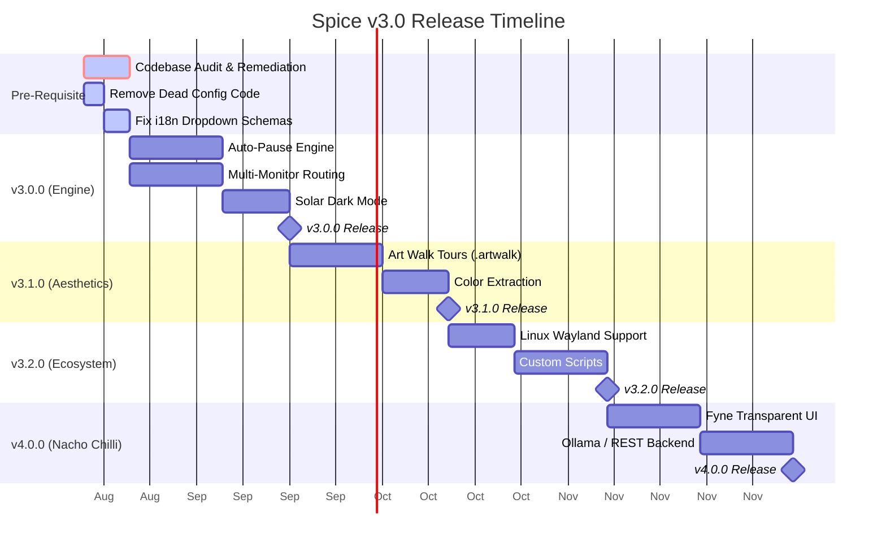
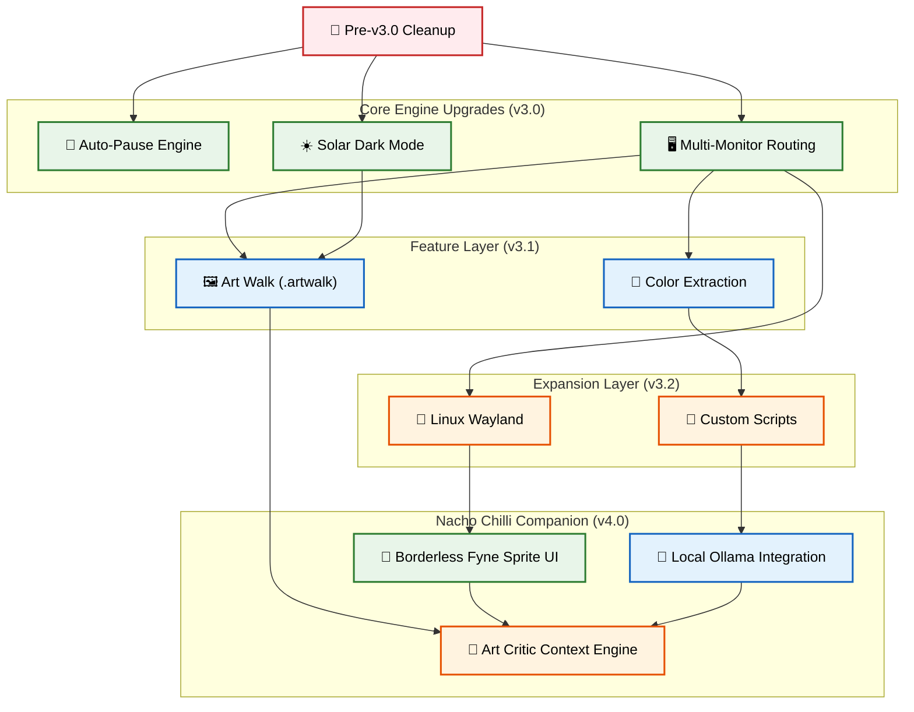

# Spice v3.0 Visual Roadmap

This document visualizes the execution sequence for the Spice v3.0 release.

## High-Level Execution Timeline

```mermaid
gantt
    title Spice v3.0 Release Timeline
    dateFormat  YYYY-MM-DD
    axisFormat  %b
    
    section Pre-Requisite
    Codebase Audit & Remediation   :crit, active, pre1, 2026-08-20, 7d
    Remove Dead Config Code        :active, pre2, 2026-08-20, 3d
    Fix i18n Dropdown Schemas      :active, pre3, after pre2, 4d
    
    section v3.0.0 (Engine)
    Auto-Pause Engine              :m1_1, after pre1, 14d
    Multi-Monitor Routing          :m1_2, after pre1, 14d
    Solar Dark Mode                :m1_3, after m1_1 m1_2, 10d
    v3.0.0 Release                 :milestone, m1_rel, after m1_3, 0d
    
    section v3.1.0 (Aesthetics)
    Art Walk Tours (.artwalk)      :m2_1, after m1_rel, 14d
    Color Extraction               :m2_2, after m2_1, 10d
    v3.1.0 Release                 :milestone, m2_rel, after m2_2, 0d
    
    section v3.2.0 (Ecosystem)
    Linux Wayland Support          :m3_1, after m2_rel, 10d
    Custom Scripts                 :m3_2, after m3_1, 14d
    v3.2.0 Release                 :milestone, m3_rel, after m3_2, 0d
    
    section v4.0.0 (Nacho Chilli)
    Fyne Transparent UI            :m4_1, after m3_rel, 14d
    Ollama / REST Backend          :m4_2, after m4_1, 14d
    v4.0.0 Release                 :milestone, m4_rel, after m4_2, 0d
```

## Dependency & Architecture Flow

```mermaid
graph TD
    classDef pre fill:#ffebee,stroke:#c62828,stroke-width:2px,color:#000;
    classDef m1 fill:#e8f5e9,stroke:#2e7d32,stroke-width:2px,color:#000;
    classDef m2 fill:#e3f2fd,stroke:#1565c0,stroke-width:2px,color:#000;
    classDef m3 fill:#fff3e0,stroke:#e65100,stroke-width:2px,color:#000;

    Debt["🧹 Pre-v3.0 Cleanup"]:::pre

    subgraph core ["Core Engine Upgrades (v3.0)"]
        Power["🔋 Auto-Pause Engine"]:::m1
        Display["🖥️ Multi-Monitor Routing"]:::m1
        Solar["☀️ Solar Dark Mode"]:::m1
    end

    Debt --> Power
    Debt --> Display
    Debt --> Solar

    subgraph feature ["Feature Layer (v3.1)"]
        ArtWalk["🖼️ Art Walk (.artwalk)"]:::m2
        PaletteExtract["🎨 Color Extraction"]:::m2
    end

    Display --> ArtWalk
    Solar --> ArtWalk
    Display --> PaletteExtract

    subgraph expansion ["Expansion Layer (v3.2)"]
        Wayland["🐧 Linux Wayland"]:::m3
        Plugins["🔌 Custom Scripts"]:::m3
    end

    Display --> Wayland
    PaletteExtract --> Plugins

    subgraph nacho ["Nacho Chilli Companion (v4.0)"]
        FyneUI["👾 Borderless Fyne Sprite UI"]:::m1
        Ollama["🧠 Local Ollama Integration"]:::m2
        Critique["🎨 Art Critic Context Engine"]:::m3
    end

    Wayland --> FyneUI
    Plugins --> Ollama
    ArtWalk --> Critique
    FyneUI --> Critique
    Ollama --> Critique
```
